## 面向对象设计的精华——类的封装、继承与多态

>类的封装、继承和多态是面向对象程序的三大特性。类的封装相当于一个黑匣子，放在黑匣子中的东西你什么也看不到。继承是类的另一个重要特性，可以从一个简单的类继承出相对复杂高级的类，通过代码重用，可使程序编写的工作量大大减轻。多态通过单一接口操作多种数据类型的对象，可动态地对对象进行调用，使对象之间变得相对独立。本章讲解类的三大特性：封装、继承和多态。
本章要点（已掌握的在方框中打钩）

* 掌握封装的基本概念和应用
* 掌握继承的基本概念和应用
* 掌握多态的基本概念和应用
* 掌握super关键字的使用熟悉对象的多态性

### 8.1 面向对象的三大特点
面向对象有三大特点：封装性、继承性和多态性，它们是面向对象程序设计的灵魂所在，下面一一给予讲解。
#### 8.1.1 封装的含义

封装（encapsulation）是将描述某类事物的数据与处理这些数据的函数封装在一起，形成一个有机整体，称为类。类所具有的封装性可使程序模块具有良好的独立性与可维护性，这对大型程序的开发是特别重要的。

类中的私有数据在类的外部不能直接使用，外部只能通过类的公共接口方法（函数）来处理类中的数据，从而使数据的安全性得到保证。封装的目的是增强安全性和简化编程，使用者不必了解具体的实现细节，仅需要通过外部接口和特定的访问权限来使用类的成员。

一旦设计好类，就可以实例化该类的对象。我们在形成一个对象的同时，也界定了对象与外界的内外界限。至于对象的属性、行为等实现的细节则被封装在对象的内部。外部的使用者和其他的对象只能经由原先规划好的接口和对象交互。我们可用一个鸡蛋的三重构造来比拟一个对象，如下图所示。
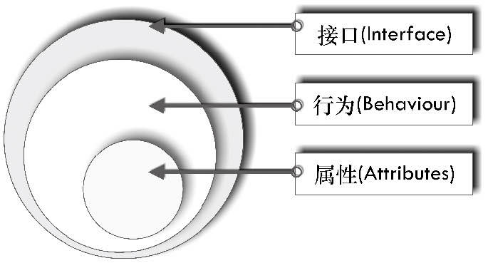

>属性好比蛋黄，它隐藏于中心，不能直接接触，它代表对象的状态（state）。
行为好比蛋白，它可以经由接口与外界交互而改变内部的属性值，并把这种改变通过接口呈现出来。
接口好比蛋壳，它可以与外界直接接触。
外部也只能通过公开的接口方法来改变对象内部的属性（数据）值，从而使类中数据的安全性得到保证。

### 8.1.2 继承的含义

对象（object）是类（class）的一个实例（instance）。如果将对象比作房子，那么类就是房子的设计图纸。所以面向对象设计的重点是类的设计，而不是对象的设计。继承性是面向对象的第二大特征。继承（inheritance）是面向对象程序设计中软件复用的关键技术，通过继承，可以进一步扩充新的特性，适应新的需求。这种可复用、可扩充技术在很大程度上降低了大型软件的开发难度，从而提高软件的开发效率。

中国古代逻辑学家公孙龙（约公元前320—公元前250年）提出了一个著名的逻辑问题：“白马非马”。在《公孙龙子 ● 白马论》中有这样的描述：“白马非马，可乎？”曰：“可。”曰：“何哉？”曰：“马者，所以命形也。白者，所以命色也。命色者，非命形也，故曰白马非马。”


在一定程度上，公孙龙的“白马非马”逻辑体现了面向对象“继承”思想。公孙龙声称：“白马不是马”，其论证过程如下。“马”只有一个特征：马的特征。而“白马”有两个特征：① 马的特征；② 白色的。因此，在逻辑上，拥有两个特征的“白马”不等同于只有一个特征的“马”，所以“白马非马”。而从集合论上来考虑，马与白马是两个不同的集合，但是“马”这个集合包含了另一个集合“白马”， 后者是前者的真子集，集合不等同于它的真子集。当我们说某一个新类A继承某一既有类B时，表示这个新类A具有既有类B的所有成员，同时对既有类的成员做出修改，或是增加了新的成员。保持已有类的特性而构造新类的过程称为继承。在已有类的基础上新增自己的特性而产生新类的过程称为派生。我们把既有类称为基类（base class）、超类（super class）或者父类（parent class），而派生出的新类，称为派生类（derived class）或子类（subclass）。继承可以使得子类自动具有父类的各种属性和方法，而不需要再次编写相同的代码，从而达到类的复用目的。这样，子类A可以对父类B的定义加以扩充，从而制订出一个不同于父类的定义，让子类具备新的特性。针对公孙龙的“白马非马”的逻辑，从面向对象角度来考虑，“马”与“白马”是两个不同的类，“马”是父类，而“白马”则是“马”的子类（或者称为派生类），后者继承了前者有关“马”的特性，同时添加了自己的新特性——“白色”，故此，父类也不等于它的子类。继承的目的在于实现代码重用，对已有的成熟的功能，子类从父类执行“拿来主义”。而派生的目的则在于，当新的问题出现时，原有代码无法解决（或不能完全解决）时，需要对原有代码进行全部（或部分）改造。对于Java程序而言，设计孤立的类是比较容易的，难的是如何正确设计好的类层次结构，以达到代码高效重用的目的。

### 8.1.3 多态的含义

从字面上理解，多态（polymorphisn）就是一种类型表现出多种状态。这也是人类思维方式的一种直接模拟，可以利用多态的特征，用统一的标识来完成这些功能。在Java中，多态性分为两类。
* （1）方法多态性，体现在方法的重载与覆写上。方法的重载是指同一个方法名称，根据其传入的参数类型、个数和顺序的不同，所调用的方法体也不同，即同一个方法名称在一个类中有不同的功能实现。有关方法的重载，我们已经在7.4节中讲解过。方法的覆写是指父类之中的一个方法名称，在不同的子类有不同的功能实现，而后依据实例化子类的不同，同一个方法可以完成不同的功能。有关方法的覆写，我们将在8.5节中详细讨论。
* （2）对象多态性，体现在父、子对象之间的转型上。在这个层面上，多态性是允许将父对象设置成为与一个或更多的子对象相等的技术，通过赋值之后，父对象就可以根据当前被赋值的不同子对象，以子对象的特性加以运作。多态意味着相同的（父类）信息，发送给不同的（子）对象，每个子对象表现出不同的形态。

多态中的一个核心概念就是，子类（派生类）对象可以视为父类（基类）对象。这很容易理解，如下图所示的继承关系中，鱼（Fish）类、鸟（Bird）类和马（Horse）类都继承于父类——动物（Animal），对于这些实例化对象，我们可以说，鱼（子类对象）是动物（父类对象）；鸟（子类对象）是动物（父类对象）；同样的，马（子类对象）是动物（父类对象）

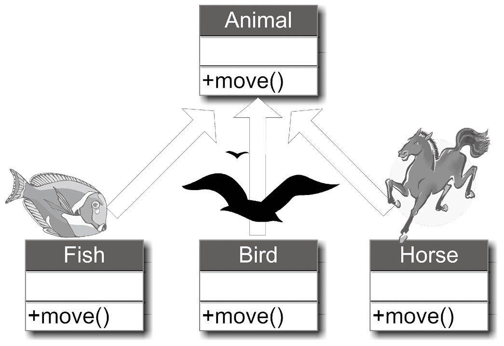

在Java编程里，我们可以用下图来描述。

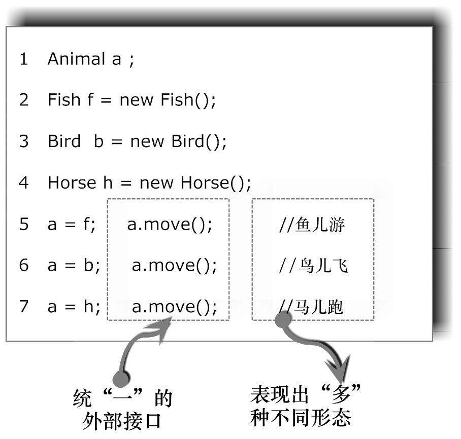

在上述代码中，第1~4行，分别定义父类对象a，并以子类对象f、b和h分别赋值给a。因为Fish类、Bird类和Horse类均继承于父类Animal，所以子类均继承了父类的move()方法。由于父类Animal的move()过于抽象，不能反映Fish、Bird和Horse等子类中“个性化”的move()方法。这样，势必需要在Fish、Bird和Horse等子类中重新定义move()方法，这样就“覆写”了父类的同名方法。在第2~4行完成定义后，我们自然可以做到：

f.move();　  //完成鱼类对象f的移动：鱼儿游
b.move();　  //完成鸟类对象b的移动：鸟儿飞
h.move();　  //完成马类对象h的移动：马儿跑

这并不是多态的表现，因为3种不同的对象对应了3种不同的移动方式，“三对三”平均下来就是“一对一”，何“多”之有呢？当子对象很多时，这种描述方式非常繁琐。

我们希望达到如上述代码第5~7行所示的效果，统一用父类对象a来接收子类对象f、b和h，然后用统一的接口“a.move()”展现出不同的形态。

当“a = f”时，“a.move()”表现出的是子类Fish的move()方法——鱼儿游，而非父类的move()方法。类似的，
当“a = b”时，“a.move()”表现出的是子类Bird的move()方法——鸟儿飞，而非父类的move()方法。
当“a = h”时，“a.move()”表现出的是子类Horse的move()方法——马儿跑，而非父类的move()方法。
这样，就达到了“一对多”的效果——多态就在这里。

父子对象之间的转型包括如下两种形式。
* （1）向上转型（Upcast）（自动转型）：父类 父类对象 = 子类实例。将子类对象赋值给父类对象，这样将子类对象自动转换为父类对象。这种转换方式是安全的。例如，我们可以说鱼是动物，鸟是动物，马是动物。这种向上转型在多态中应用得很广泛。
* （2）向下转型（Downcast）（强制转型）：子类 子类对象 = (子类) 父类对象。将父类对象赋值给子类对象。这种转换方式是非安全的。例如，如果我们说动物是鱼，动物是鸟，动物是马，这类描述是不全面的。因此，在特定背景下如果需要父类对象转换为子类对象，就必须使用强制类型转换。这种向下转型用得比较少。

### 8.2 封装的实现

#### 8.2.1 Java访问权限修饰符

在讲解Java面向对象三大特性之前，有必要先介绍一下关于Java访问权限修饰符的知识。在Java中有4种访问权限：公有（public）、私有（private）、保护（protected）、默认（default）。但访问权限修饰符只有3种，因为默认访问权限没有访问权限修饰符。默认访问权限是包访问权限，即在没有任何修饰符的情况下定义的类，属性和方法在一个包内都是可访问的。具体访问权限的规定如下表所示。

|   |  私有（private） | 默认（default）  | 保护（protected）  | 公有（public）  |
| ------------ | ------------ | ------------ | ------------ | ------------ |
| 类  | 只有内部类允许私被访问  |可以被当前包访问   | 只有内部类可以设为保护权访问  |  可以被所有访问 |
| 属性  |只能被当前类访问   | 可以被相同包中的类访问  |  可以被相同包中的类和当前类的子类访问 | 可以被所有类访问  |
| 方法  | 只能被当前类访问  | 可以被相同包中的类访问  | 可以被相同包中的类和当前类的子类访问  | 可以被所有类访问  |

### 8.2.2 封装问题引例

在8.1.1节中，我们给出类封装性的本质，但对读者来说，这个概念可能还是比较抽象。从哲学的角度来说，我们要“透过现象看本质”，现在本质给出了，如果还不能理解的话，其实是我们没有落实“透过现象”这个流程。下面我们给出一个实例（现象）来说明上面论述的本质。

假设我们把对象的属性（数据）暴露出来，外界可以任意接触到它甚至能改变它。读者可以先看下面的程序，看看会产生什么问题。

范例8-1 类的封装性使用引例—— 一只品质不可控的猫（TestCat.Java）
```
public class TestCat　{　　 
    public static void main(String[] args){　　
        　  MyCat aCat = new MyCat();　　
        　  aCat.weight = -10f;　　　 //设置MyCat的属性值　　
        　  float temp = aCat.weight;　 //获取MyCat的属性值　　
        　  System.out.println("The weight of a cat is : " + temp);　　
          　 }　
          } 
    class MyCat　{　
           public float weight;　//通过public修饰符，开放MyCat的属性给外界　
           MyCat(){　　

               　 }　
        }
```
保存并运行程序，运行结果如下图所示。


代码详解首先我们来分析一下MyCat类。第15行通过public修饰符，开放MyCat的属性（weight）给外界，这意味着外界可以通过“对象名.属性名”的方式来访问（读或写）这个属性。第16行声明一个无参构造方法，在本例中无明显含义。

第05行，定义一个对象aCat。第08行通过点操作符获得这个对象的值。第09行输出这个对象的属性值。我们需要重点关注第06行，它通过“点操作符”设置这个对象的值（-10.0f）。一般意义上，“-10.0f ”是一个普通的合法的单精度浮点数，因此在纯语法上，它给weight赋值没有任何问题。

但是对于一个真正的对象（猫）来说，这是完全不能接受的，一个猫的重量（weight）怎么可能为负值？这明显是“一只不合格的猫”，但是由于weight这个属性开放给外界，“猫的体重值”无法做到“独立自主”，因为它的值可被任何外界的行为所影响。

那么如何来改善这种状况呢？这时，类的封装就可以起到很好的作用。请参看下节的案例。
#### 8.2.3 类的封装实例
读者可以看到，前面列举的程序都是用对象直接访问类中的属性，在面向对象编程法则里，这是不允许的。所以为了避免发生这样类似的错误，通常要将类中的属性封装，用关键词“private”声明为私有，从而保护起来。对范例TestCat.Java做了相应的修改后，就可构成下面的程序。
范例8-2 类的封装实例—— 一只难以访问的猫（TestCat.Java）
```
　public class TestCat
　{
　　 public static void main(String[] args)
　　 {
    　　　  MyCat aCat = new MyCat();
    　　　  aCat.weight = -10.0f;　　　 //设置MyCat的属性值
    　　  
   　　　  int temp = aCat.weight;　　 //获取MyCat的属性值
   　　  System.out.println("The weight of a cat is : " + temp);
    　　 　 }
    　}
    　
 　class MyCat
    　{
        　 private float weight;　　　  //通过private修饰符封装属性
       　  MyCat()
       　　  {
            　　　
           　　  }
            　}
```          

代码详解第13~19行声明了一个新的类MyCat，类中有属性weight，与前面范例不同的是，这里的属性在声明时，前面加上了访问控制修饰符private。【范例分析】可以看到，本程序与上面的范例8-1相比，在声明属性weight前，多了个修饰符private（私有的）。但就是这一个小小的关键字，却使得下面同样的代码连编译都无法通过。

```
MyCat  aCat = new MyCat();
aCat.weight = -10;　　　 //设置MyCat的属性值，非法访问
int temp = aCat.weight;　　//获取MyCat的属性值，非法访问其

```
所提示的错误如下图所示。


这里的“字段（Field）”就是Java里的“数据属性”。因为weight为私有数据类型，所以对外界是不可见的（The field MyCat.weight is not visible），换句话说，对象不能通过点操作（.）直接访问这些私有属性，因此代码第06行和第08行是无法通过编译的。
这样虽然可以通过封装，达到外界无法访问私有属性的目的，但如果的确需要给对象的属性赋值，该怎么办呢？
问题的解决方案是，在设计类时，程序设计人员都设计或存/取这些私有属性的公共接口，这些接口的外在表现形式都是公有（public）方法，而在这些方法里，我们可以对存或取属性的操作实施合理的检查，以达到保护属性数据的目的。
通常，对属性值设置的方法被命名为SetXxx()，其中Xxx为任意有意义的名称，这类方法可统称为Setter方法。而对取属性值的方法通常命名为GetYyy，其中Yyy为任意有意义的名称，这类方法可统称为Getter方法。请看下面的范例。
范例8-3 类私有属性的Setter和Getter方法—— 一只品质可控的猫（TestCat.java）

```
　 public class TestCat
　 {
    　　  public static void main(String[] args)
    　　  {
        　　　　MyCat aCat = new MyCat( );
        　　　　aCat.SetWeight(-10);　　　 //设置MyCat的属性值
       　　　　
          　　　　float temp = aCat.GetWeight( );　 //获取MyCat的属性值
          　　　　System.out.println("The weight of a cat is : " + temp);
          　　　　
          　　  }
          　 }
          　 
          　 class MyCat
          　 {
              　　　private float weight;　　　  //通过private修饰符封装MyCat的属性
              　　　public void SetWeight( float wt)
              　　　{
                  　　　　 if (wt > 0)
                  　　　　 {
                      　　　　　  weight = wt;
                      　　　　 }
                      　　　　 else 
                      　　　　 { 
                          　　　　　  System.out.println("weight 设置非法 (应该>0). \n 采用默认值");
                          　　　　　  weight  = 10.0f;
                          　　　　 }
                          　　　}
                          　　　public float GetWeight( )
                          　　　{
                              　　　　 return weight;
 }
```                              

保存并运行程序，结果如下图所示。
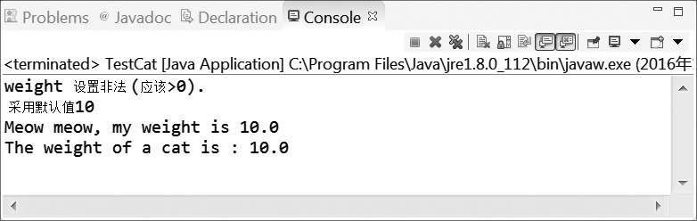

## 代码详解
第17~28行，添加了SetWeight( float wt)方法，第29~32行添加了GetWeight()方法，这些方法都是公有类型的（public），外界可以通过这些公有的接口来设置和取得类中的私有属性weight。第06行调用了SetWeight()方法，同时传进一个“-10f ”的不合理体重值。在SetWeight( float wt)方法中，在设置体重时，程序中加了些判断语句，如果传入的数值大于0，则将值赋给weight属性，否则给出警告信息，并采用默认值。通过这个方法可以看出，经由公有接口来对属性值实施操作，我们可以在这些接口里对这些值实施“管控”，从而更好地控制属性成员。

## 【范例分析】
可以看到在本程序中，由于weight传进了一个“-10”的不合理的数值（-10后面的f表示这个数是float类型），这样在设置MyCat属性时，因不满足条件而不能被设置成功，所以weight的值采用自己的默认值（10）。这样在输出的时候可以看到，那些错误的数据并没有被赋到属性上去，而只输出了默认值。由此可知，用private可将属性封装起来，当然也可用private把方法封装起来，封装的形式如下。封装属性：private 属性类型 属性名封装方法：private 方法 返回类型 方法名称（参数）
## 注意
用private声明的属性或方法只能在其类的内部被调用，而不能在类的外部被调用。读者可以先暂时简单地理解为，在类外部不能用对象去调用private声明的属性或方法。

下面的这个范例添加了一个MakeSound()方法，通过修饰符private（私有）将其封装了起来。
范例8-4 方法的封装使用（TestCat.Java）

```
public class TestCat  　 
{ 　  public static void main(String[] args)　　  {
    　　　　MyCat aCat = new MyCat();
    　　　　aCat.SetWeight(-f);　　　 //设置MyCat的属性值
    　　　　float temp = aCat.GetWeight(); //获取MyCat的属性值
    　　　　System.out.println("The weight of a cat is : " + temp);
    　　　　aCat.MakeSound();
    　　　　　　  }　
     }
 class MyCat　
  {　　　private float weight;　　　  //通过private修饰符封装MyCat的属性
  　　　public void SetWeight( float wt)　　　{　
      　　　 if (wt >0 )
      　　　　 {　　　　　  weight = wt;
      　　　　 }　　　　 else 　　　　 { 
          　　　　　  System.out.println("weight 设置非法 (应该>). \n 采用默认值10");　
          　　　　  weight  = 10.0f;　
          　　　 }　　
          　}　　　
          public float GetWeight()　　　{　
              　　　 return weight;　　　}　　　　
              　　private void MakeSound()　
              　　{　　　　 System.out.println( "Meow meow, my weight is " + weight );　　
              　}　
               }
```
保存并运行程序，结果如下图所示。
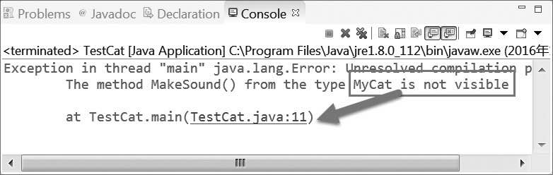
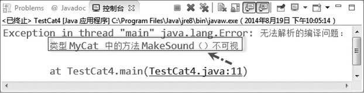

代码详解
第35行将MakeSound()方法用private来声明。第10行，想通过对象的点操作符“.”来尝试调用这个私有方法。由于私有方法是不对外公开的，因此得到上述的编译错误：“Themethod MakeSound() from the type MyCat is not visible”（在类MyCat中的方法 MakeSound()不可见）。
范例分析】
一旦方法的访问权限被声明为private（私有的），那么这个方法就只能被类内部方法所调用。如果想让上述代码编译成功，其中一种方法是，将第10行的代码删除，而在GetWeight()中添加调用MakeSound()方法的语句，
如下所示。

```
public float GetWeight()

{　  MakeSound();　  //方法内添加的方法调用　
  return weight;
}
```


  
访问权限控制符是对类外而言的，而在同一类中，所有的类成员属性及方法都是相互可见的，也就是说，它们之间是可以相互访问的。在改造GetWeight()后，程序成功运行的结果如下图所示。


如果类中的某些数据在初始化后，不想再被外界修改，则可以使用构造方法配合私有化的Setter 函数来实现该数据的封装，
如下所示。范例8-5 使用构造函数实现数据的封装（TestEncapsulation.Java）

```
　 class MyCat
　 {
　　  // 创建私有化的属性weight，height  
　　  private float weight;
　　  private float height;
　　  // 在构造函数中初始化私有变量
　　  public MyCat( float height, float weight )
　　  {
　　　　SetHeight( height );// 调用私有方法设置height
　　　　SetWeight( weight );// 调用私有方法设置weight
　　  }
　 
　　  //通过private修饰符封装MyCat的SetWeight方法
　　  private void SetWeight( float wt)
　　  {
　　　　if (wt > 0) {　weight = wt;　}
　　　　else　　  { 
　　　　　 System.out.println("weight 设置非法 (应该>0).  采用默认值10");
　　　　　 weight  = 10.0f;
　　　　}
　　  }
　　//通过private修饰符封装MyCat的SetHeight方法
　　  private void SetHeight(float ht)
　　  {
　　　　if (ht > 0)  {　height = ht;　  }
　　　　else　　{ 
　　　　　 System.out.println("height 设置非法 (应该>0).  采用默认值20");
　　　　　 height  = 20.0f;
　　　　}
　　  } 
　　  // 创建公有方法GetWeight()作为与外界的通信的接口
　　  public float GetWeight()　  {　　  return weight;　 }
　　  // 创建公有方法GetHeight()作为与外界的通信的接口
　　  public float GetHeight()　 {　　  return height;　 }
　 }
　 
　 public class TestEncapsulation
　 {
　　  public static void main( String[] args )
　　  {
　　　　MyCat aCat = new MyCat( 
, -5 ); //通过公有接口设置属性值　　
　　　　
　　　　float ht = aCat.GetHeight();　　 //通过公有接口获取属性值height
　　　　float wt = aCat.GetWeight();　　 //通过公有接口获取属性值weight
　　　　System.out.println("The height of cat is " + ht);
　　　　System.out.println("The weight of cat is " + wt);
　　  }
　 }
```
保存并运行程序，结果如下图所示。


代码详解
在第07~11行中的MyCat类的构造方法，通过调用私有化SetHeight()方法（在第23~30行定义）和私有化SetWeight()方法（在第14~21行定义）来对height和weight进行初始化。这样类MyCat的对象aCat一经实例化（第41行），name和age私有属性便不能再进行修改，这是因为构造方法只能在实例化对象时自动调用一次，而SetHeight()方法和SetWeight()方法的访问权限为私有类型，外界又不能调用，所以就达到了封装的目的。
【范例分析】
通过构造函数初始化类中的私有属性，能够达到一定的封装效果，但是也不能过度相信这种封装，有些情况下即使这样做，私有属性也有可能被外界修改。例如，在下面就会讲到封装带来的问题。
提示
读者可能会问，到底什么时候需要封装，什么时候不用封装。在这里可以告诉读者，关于封装与否并没有一个明确的规定，不过从程序设计的角度来说，设计较好的程序的类中的属性都是需要封装的。此时要设置或取得属性值，则只能使用Setter和Getter方法，这是一个比较标准的做法。

在Java中，最基本的封装单元是类，类是基于面向对象思想编程的基础，程序员可以把具有相同业务性质的代码封装在一个类里，然后通过共有接口方法向外部提供服务，同时向外部屏蔽类中的具体实现方式。

数据封装的重要目的在于实现“信息隐藏（Information Hidding）”。在类中的“数据成员（属性）”或者“方法成员”，都可以使用关键字“public”“private”“protected”来设置各成员的访问权限。例如，我们可以把“SetHeight()”这个方法封装在“MyCat”类中，通过设置private访问权限，不开放给外界使用，因此，“TestEncapsulation类”就无法调用“SetHeight()”这个方法，来设置Mycat中的height属性值。

封装性是面向对象程序设计的原则之一。它规定对象应对外部环境隐藏它们的内部工作方式。良好的封装可以提高代码的模块化程度，它防止了对象之间不良的相互影响，使程序达到强内聚（许多功能尽量在类的内部独立完成，不让外面干预），弱耦合（提供给外部尽量少的方法调用）的最终目标。

### 8.3 继承的实现

在前面我们已经了解了类的基本使用方法。对于面向对象的程序而言，它的精华还在于类的继承。继承能以既有的类为基础，进而派生出新的类。通过这种方式便能快速地开发出新的类，而不需编写相同的程序代码，这就是程序代码复用（reuse）的概念。

#### 8.3.1 继承的基本概念

在Java中，通过继承可以简化类的定义，扩展类的功能。在Java中支持类的单继承和多层继承，但是不支持多继承，即一个类只能继承一个类，而不能继承多个类。实现继承的格式如下。class 子类名 extends 父类extends 是Java中的关键词。
Java继承只能直接继承父类中的公有属性和公有方法，而隐含地(不可见地)继承了私有属性。现在假设有一个Person类，里面有name与age两个属性，而另外一个Student类，需要有name、age、school3个属性，如下图所示。因为Person中已存在有name和age两个属性，所以不希望在Student类中重新声明这两个属性，这时就需考虑是否可将Person类中的内容继续保留到Student类中，这就引出了接下来要介绍的类的继承概念。在这里希望Student类能够将 Person类的内容继承下来后继续使用，可用下图表示，这样就可以达到代码复用的目的。

Java类的继承可用下面的语法来表示。
class 父类　
{ 　 // 定义父类
}
class 子类extends父类
{　  // 用extends关键字实现类的继承
}
### 8.3.2 继承问题的引入

首先，我们观察一下下面的例子，在下面的例子中，包括Person和Student两个类。
范例8-6 继承的引出（LeadInherit.Java）

```

　 class Person {
　　  String name;
　　  int age;
　　  Person( String name, int age ) {
　　　　this.name = name;
　　　　this.age = age;
　　  }
　 
　　  void speak() {
　　　　System.out.println( "我的名字叫：" + name + "  我" + age + "岁" );
　　  }
　 }
　 
　 class Student {
　　  String name;
　　  int age;
　　  String school;
　　  Student( String name, int age, String school ) {
　　　　this.name = name;
　　　　this.age = age;
　　　　this.school = school;
　　  }
　　  void speak() {
　　　　System.out.println( "我的名字叫：" + name + "  我" + age + "岁" );
　　  }
　　  void study() {
　　　　System.out.println( "我在 " + school + "读书" );
　　  }
　 }
　 
　 public class LeadInherit {
　　  public static void main( String[] args ) {
　　　　// 实例化一个Person对象
　　　　Person person = new Person( "张三", 21 );
　　　　person.speak();
　　　　// 实例化一个Student对象
　　　　Student student = new Student( "李四", 20, "HAUT" );
　　　　student.speak();
　　　　student.study();
　　  }
　 }
```


保存并运行程序，结果如下图所示。


代码详解

上面代码的功能很简单，在第01~12行定义了Person类，其中第04~07行为Person类的构造方法。第14~29行定义了Student类，并分别定义了其属性和方法。第34行和第37行分别实例化Person类和Student类，并定义了两个对象person和student（首字母小写，别于类名）。通过具体的代码编写，我们可以发现，这两个类中有很多相同的部分，例如，两个类中都有name、age属性和speak()方法。这就造成了代码的臃肿。软件开发的目标是“软件复用，尽量没有重复”，因此，有必要对范例8-6实施改造。

### 8.3.3 继承实现代码复用
为了简化范例8-6，我们使用继承来完成相同的功能，请参见下面的范例。

范例8-7 类的继承演示程序（InheritDemo.Java）

```
　 class Person {
　　  String name;
　　  int age;
　　  Person( String name, int age ){
　　　　this.name = name;
　　　　this.age = age;
　　  }　
　　  void speak(){
　　　 System.out.println( "我的名字叫：" + name + " ,今年我" + age + "岁" );
　　  }
　 }
　 
　 class Student extends Person {
　　  String school;
　　  Student( String name, int age, String school ){
　　　　super(name, age);
　　　　this.school = school;
　　  }
　　  void study(){
　　　　System.out.println( “我在 " + school + "读书" );
　　  } 
　 }
　 public class InheritDemo 
　 {
　 　public static void main( String[] args )
　 　{
　 　　// 实例化一个Student对象
　 　　Student  s = new Student(“张三",25
,"工业大学");
　 　　s.speak();
　 　　s.study();
　 　}
　 }
```


保存并运行程序，结果如下图所示。

代码详解第01~11行声明了一个名为Person的类，里面有name与age两个属性和一个方法speak()。其中，第04~07行定义了Person类的构造方法Person( )，用于初始化name和age两个属性。为了区分构造方法Person( )中同名的形参和类中属性名，赋值运算符“=”左侧的“this.”，用以表明左侧的name和age是来自类中。第13~22行声明了一个名为Student的类，并继承自Person类（使用了extends关键字）。
在Student类中，定义了school属性和study()方法。其中，第15~18行定义了Student类的构造方法Student()。虽然在Student类中仅定义了school属性，但由于Student类直接继承自Person类，因此Student类继承了Person类中的所有属性，也就是说，此时在Student类中有3个属性成员，如下图所示。两个（name和age）来自于父类，一个（school）来自于当前子类。构造方法用于数据成员的初始化，但要“各司其职”，对来自于父类的数据成员，需要调用父类的构造方法，例如，在第16行，使用super关键字加上对应的参数，就是调用父类的构造方法。
而在第17行，来自本类的school属性，直接使用“this.school = school;”来实施本地初始化。同样的，由于Student类直接继承自Person类，Student类中“自动”拥有父类Person类中的方法speak()，加上本身定义的study()方法和Student()构造方法，其内共有3个方法，而不是第15~21行表面看到的2个方法。第28行声明并实例化了一个Student类的对象s。第29行调用了继承自父类的speak()方法。第30行调用了Student类中的自己添加的study()方法。提示在Java中只允许单继承，而不允许多重继承，也就是说一个子类只能有一个父类，但在Java中允许多层继承。

### 8.3.4 继承的限制

以上实现了继承的基本要求，但是对于继承性而言，实际上也存在着若干限制，下面一一对这些限制进行说明。

限制1：Java之中不允许多重继承，但是可以使用多层继承。所谓的多重继承指的是一个类同时继承多个父类的行为和特征功能。以下通过对比进行说明。范例：错误的继承——多重继承。

class A{　}
class B{　}
class C extends A,B  　// 错误：多重继承
{　}
从代码中可以看到，类C同时继承了类A与类B，也就是说C类同时继承了两个父类，这在Java中是不允许的，如下图所示。

虽然上述语法有错误，但是在这种情况下，如果不考虑语法错误，以上这种做法的目的是：希望C类同时具备A和B类的功能，所以虽然无法实现多重继承，但是却可以使用多层继承的方式来表示。所谓多层继承，是指一个类B可以继承自某一个类A，而另外一个类C又继承自B，这样在继承层次上单项继承多个类，如下图所示。

class A{　 }


从继承图及代码中可以看到，类B继承了类A，而类C又继承了类B，也就是说类B是类A的子类，而类C则是类A的孙子类。此时，C类就将具备A和B两个类的功能，但是一般情况下，在我们编写代码时，多层继承的层数之中不要宜超过3层。

限制2：从父类继承的私有成员，不能被子类直接使用。子类在继承父类的时候，会将父类之中的全部成员（包括属性及方法）继承下来，但是对于所有的非私有（private）成员属于显式继承，而对于所有的私有成员采用隐式继承（即对子类不可见）。子类无法直接操作这些私有属性，必须通过设置Setter和Getter方法间接操作。

限制3：子类在进行对象实例化时，从父类继承而来的数据成员需要先调用父类的构造方法来初始化，然后再用子类的构造方法来初始化本地的数据成员。

子类继承了父类的所有数据成员，同时子类也可以添加自己的数据成员。但是，需要注意的是，在调用构造方法实施数据成员初始化时，一定要“各司其职”，即来自父类的数据成员需要调用父类的构造方法来初始化，而来自子类的数据成员初始化，要在本地构造方法中完成。在调用次序上，子类的构造方法要遵循“长辈优先”的原则：先调用父类的构造方法（生成父类对象），然后再调用子类的构造方法（生成子类对象）。也就是说，当实例化子类对象时，父类的对象会先“诞生”——这符合我们现实生活中对象存在的伦理。

限制4：被final修饰的方法不能被子类覆写实例，被final修饰的类不能再被继承。
Java的继承性确实在某些时候提高了程序的灵活性和代码的简洁度，但是有时我们定义了一个类却不想让其被继承，即所有继承关系到此为止，如何实现这一目的呢？为此，Java提供了final关键字来实现这个功能。
final在Java之中称为终结器（terminator）：
①在基类的某个方法上加final，那么在子类中该方法被禁止二次“改造”（即禁止被覆写）；
② 通过在类的前面添加final关键字，便可以阻止基类被继承。
范例8-8 final标记的方法不能被子类覆写实例（TestFinalDemo.java）


```
　class Person
　{
　　// 此方法声明为final不能被子类覆写
　　final public String talk()
　　{
　　　return "Person：talk()" ;
　　}
　}
　class Student extends Person
　{
　　public String talk()
　　{
　　　return "Student：talk()" ;
　　}
　}
　public class TestFinalDemo 
　{
　　 public static void main(String args[]) 
　　 {
　　　  Student S1=new Student();
　　　  System.out.println(S1.talk());
　　 }
　}

```
保存并运行程序，程序并不能正确运行，会提示如下图所示的错误。


代码详解

第01~08行声明了一个Person类并在类中定义了一个由final修饰的talk( )方法。第09~15行声明了一个Student类，该类使用关键词extends，继承了Person类。在Student类中重写了talk( )方法。第20行新建一个对象，并在第21行调用该对象的talk( )方法。【范例分析】在运行错误界面图中发生了JNI错误（A JNI has occurred），这里的JNI指的是“JavaNative Interface （Java 本机接口）”，由于在第04行，talk( )方法用了final修饰，用它修饰的方法在子类中是不允许覆写改动的，这里final有“一锤定音”的意味。而子类Student在第11~14行尝试推翻终局（final），改动从父类中继承而来的talk( )方法，于是Java虚拟机就“罢工”报错了。

范例8-9 用final继承的限制（InheritRestrict.java）

```

　 //定义被final修饰的父类
　 final class SuperClass
　 {
　　  String name;
　　  int age;
　 }
　 //子类SubClass继承SuperClass
　 class SubClass extends SuperClass
　 {
　　  //do something
　 }
　 public class InheritRestrict 
　 {
　　  public static void main(String[] args)
　　  {
　　　　SubClass subClass = new SubClass();
　　  }
　 }
```
保存并编译程序，得到的编译错误信息如下图所示。

代码详解

因为在第02行创建的父类SuperClass前用了final修饰，所以它不能被子类SubClass继承。通过上面的编译信息结果也可以看出：“The type SubClass cannot subclass the final class SuperClass（类型 SubClass 不能成为终态类 SuperClass的子类）”。

### 8.4 深度认识类的继承

关于继承的问题，有一些概念和过程需要澄清，有些语法和术语需要熟练掌握，下面我们做一个总结。
#### 8.4.1 子类对象的实例化过程


既然子类可以直接继承父类中的方法与属性，那父类中的构造方法是如何处理的呢？子类对象在实例化时，子类对象实例化会默认先调用父类中的无参构造函数，然后再调用子类构造方法。

请看下面的范例，并观察实例化操作流程。
范例8-10 子类对象的实例化（SubInstantProcess.java）


```
　 class Person
　 {
　　  String name ;
　　  int age ;  
　　  public Person() // 父类的构造方法
　　  {
　　　　System.out.println("***** 父类构造：1. publicPerson()") ;
　　  }
　 }
　 class Student extends Person
　 {
　　  String school ;  
　　  public Student() // 子类的构造方法
　　  {
　　　　System.out.println("##### 子类构造：2. public Student()");
　　  }
　 }
　 
　 public class SubInstantProcess
　 {
　　 public static void main(String[] args) 
　　 {
　　　 Student s = new Student() ;
　　 }
　 }

```

保存并运行程序，结果如下图所示。

代码详解

第01~09行声明了一个Person类，在这个类中设计了一个无参构造方法Person()。实际上，构造方法的主要功能是用于构造对象，初始化数据成员，这里仅为了演示方便，输出了“***** 父类构造：

1. publicPerson()”的字样。第10~17行声明了一个Student类，此类继承自Person类，它也有一个无参构造方法，并在这个构造方法中输出了“##### 子类构造：
2. public Student()”的字样。第23行声明并实例化了一个Student这个子类对象s。从程序输出结果中可以看到，虽然第23行实例化的是子类的对象，其必然调用的是子类的无参构造方法，但是父类之中的无参构造方法也被默认调用了。由此可以证明：子类对象在实例化时，会默认先去调用父类中的无参构造方法，之后再调用子类本身的相应构造方法。实际上，在本例中，在子类构造方法的首行相当于默认隐含了一个“super()”语句。上面的Student类如果改写成下面的形式，也是合法的。
class Student extends Person{　 String school ;  　 
public Student( ) // 子类的构造方法　 
{　　  super( ) ;　//隐含了这样一条语句，它负责调用父类构造　
System.out.println("##### 子类构造：
2. public Student()");　 }}其中，如果用户显式地用super( )去调用父类的构造方法，那么它必须出现在这个子类构造方法中的第1行语句。详细讨论请参见下一节。


### 8.4.2 super关键字的使用

在上面的程序中，我们提到了super关键字的使用，那super到底是什么？从英文本意来说，它表示“超级的”，从继承体系上，父类相对于子类是“超级的”，因此，有时候我们也称父类为超类（super-class）。从范例8-10后面的解释中，读者应该可以发现，super关键字出现在子类中，而且主要目的是，在子类中调用父类的属性或方法。这里也多少有点“互不干涉内政”的意思，虽然通过继承，子类拥有父类的某些数据成员或方法，但是如果想对这些类中父类的成员（数据或方法）进行操作，还得请父类自己“亲自出马”，自己的事情自己干。而super关键字就是打通父类和子类之间协作的桥梁。范例8-10仅仅显示的是如何调用父类的无参构造方法。如果子类继承了父类的数据成员，这时就需要调用父类的有参构造方法，来初始化来自于父类的数据成员，那如何做到这一点呢？这就需要显式地调用父类中的有参构造方法super(参数1，参数2…)。
将范例8-10做相应的修改，就构成了下面的范例。
范例8-11 super调用父类中的构造方法（SuperDemo.Java）

```
　  class Person
　 {
　　  String name;
　　  int age;
　　  
　　  public Person( String name, int age )　  // 父类的构造方法
　　  {
　　　　this.name = name;
　　　　this.age = age;
　　  }
　 }
　 
　 class Student extends Person
　 {
　　  String school;
　　　　　　　　　　　　　 // 子类的构造方法
　　  public Student(String name, int age, String school)
　　  {　
　　　　super( name, age );　　　　 // 用super调用父类中的构造方法
　　　　this.school = school;
　　  }
　 }
　 
　 public class SuperDemo
　 {
　　  public static void main( String[] args )
　　  {
　　　　Student s = new Student("Jack", 30, "HAUT");
　　System.out.println( "Name：" + s.name + ", Age：" + s.age + ", School：" + s.school );
　　  }
　 }
```

保存并运行程序，结果如下图所示。
代码详解
第01~11行声明了一个名为Person的类，里面有name和age两个属性，并声明了一个含有两个参数的构造方法。第13~22行声明了一个名为Student的类，此类继承自Person类。第17~21行声明了一个子类的构造方法Student()，在此方法中传递了3个形参name、age和school，其中，两个形参name和age用于super()方法，借此调用父类中有两个参数的构造方法。注意到语句“super( name, age );”位于子类构造方法中的第一行（第19行）。第20行用形参school本地初始化子类自己定义的数据成员school（用this.来区分同名的形参）。第28行声明并实例化了一个Student类的对象s，然后传递了3个实参用于初始化Student类的3个数据成员（其中2个来自父类Person的继承，1个来自于自己类中的定义）。读者可以看到，本例与范例8-10程序基本模式是一致的，不同之处在于，在子类的构造方法中明确地使用super( name, age )，指明调用的是父类中含有两个参数的构造方法。需要读者注意的是：调用super()必须写在子类构造方法的第一行，否则编译不予通过。每个子类构造方法的第一条语句，都是隐含地调用super()，如果父类没有提供这种形式的构造方法，那么在编译的时候就会报错。例如，如果我们很“调皮”地调整了范例8-11中的第19和20行代码的先后次序，就会得到如下图所示的编译错误：“Constructor callmust be the first statement in a constructor（构造方法调用，必须是构造方法的第一个

事实上，super关键字不仅可用于调用父类中的构造方法，也可用于调用父类中的属性或方法，如下面的格式所示。
super.父类中的属性;super.父类中的方法() ;
对范例8-11稍加改造，就形成了通过super调用父类属性和方法的范例8-12。范例8-12 通过super调用父类的属性和方法（SuperDemo2.Java）

```

　 class Person
　 {
　　　String name;
　　　int age;
　　　// 父类的构造方法
　　　public Person()
　　  {
　　　}
　　　public String talk()
　　  {
　　　　 return "I am ：" + this.name + ", I am： " + this.age + " years old";
　　  }
　 }
　 class Student extends Person
　 {
　　　 String school;
　　　 // 子类的构造方法
　　　 public Student( String name, int age, String school )
　　　{
　　　　　// 在这里用super调用父类中的属性
　　　　　super.name = name;
　　　　　super.age = age;
　 
　　　　　// 调用父类中的talk()方法
　　　　　System.out.print( super.talk() );
　 
　　　　　 // 调用本类中的school属性
　　　　　 this.school = school;
　 }
　 }
　 
　 public class SuperDemo
3　 {
　　　public static void main( String[] args )
　　　{
　　　　　Student s = new Student( "Jack", 
, "HUAT" );
　　　　　System.out.println( ",I am  form ：" + s.school );
　　　 }
　 }
```

保存并运行程序，结果如下图所示。

代码详解

第01~13行声明了一个名为Person的类，并声明了name和age两个属性、一个返回String类型的talk()方法，以及一个无参构造方法Person()，父类的构造方法是个空方法体，它并没有实施初始化。第14~30行声明了一个名为Student的类，此类直接继承自Person类。第21行和第22行，通过“super.属性”的方式调用父类中的name和age属性，并分别赋值。第25行通过“super.方法名”的方式调用父类中的talk()方法，打印信息。从程序中可以看到，子类Student可以通过super调用父类中的属性或方法。但是细心的读者在本例 中可以发现，如果第21行、第22行、第25行换成this调用也是可以的，那为什么还要用super呢？super 是相对于继承而言的。super 代表的是当前类的父类，而this是代表当前类。如果父类的属性和方法的访问权限不是private（私有的），那么这些属性和方法在子类中是可视的，换句话说，这些属性和方法也可视为当前类所有的，那么用“this.”来访问也是理所当然的。如果子类对“父类”很“见外”，分得很清楚，那么就可用 “super.”访问来自于父类的属性和方法。8.4.3 限制子类的访问有时候，父类也想保护自己的“隐私”，即使自己的成员被子类继承了，但并不希望子类可以访问自己类中全部的属性或方法，这时，就需要将一些属性与方法隐藏起来，不让子类去使用。为此可在声明属性或方法时加上“private”关键字，表示私有访问权限，即除了声明该属性或方法的所在类，其他外部的类（包括子类）均无权访问。
范例8-13 限制子类的访问（RestrictVisit.Java）

```

　class Person
　{
　　  // 在这里将属性封装
　　  private String name ;
　　  private int age ;
　}
　class Student extends Person
　{
　　 // 在这里访问父类中被封装的属性
　　 public void setVar()
　　 {
　　　 name = "张三" ;
　　　 age = 25 ;
　　}
　}
　
　class RestrictVisit
　{
　　 public static void main(String[] args) 
　　 {
　　　 new Student().setVar() ;
　　}
　}
```
保存并编译程序，结果如下图所示。
代码详解Student类继承自Person类，所以父类的数据（属性）成员name和age也被子类继承了，但是子类相对于父类也属于外类，在父类中，数据成员name和age的访问权限被设置为private，故子类即使继承了这个数据成员，也无法访问，它们在子类中均“不可视”（“The field Person.age/name is not visible”），所以在第12~13行会出现编译错误。此时，即使在属性成员前加上“super.”，也不会编译成功，这体现了类的封装性。12　　　super.name = "张三" ;　//name不可视，编译错误13　　　super.age = 25 ;　　  // age不可视， 编译错误在代码的第21行中，代码的前半部分“new Student()”创建一个无名的Student对象。一旦有了对象，就可以通过“对象名.方法名()”的方式调用setVar()方法。这种创建无名对象的方式只能临时创建一个对象，使用一次后即自动销毁了。虽然父类的私有成员，外部（包括子类）无法访问，但是在父类内部，自己的属性和方法彼此之间，是不受访问权限约束的，换句话说，父类的方法可以无障碍地访问父类的任何属性和访问。
针对范例8-13存在的问题，我们可以用父类的方法（如构造方法）来访问父类的私有数据成员。请参见下面的范例。
范例8-14 子类访问父类的私有成员（RestrictVisit2.Java）

```

　 class Person{
　　  // 在这里使用private将属性封装
　　  private String name;
　　  private int age;
　　  Person(String name, int age)

　　  {
　　　　this.name = name;
　　　　this.age = age;
　　  }
　　  // 在这里设置属性的值
　　  void setVar(String name, int age)
　　  {
　　　　this.name = name;
　　　　this.age = age;
　　  }　
　　  void print()
　　  {
　　　　System.out.println("I am : " + name + ", I am : " + age + " years old");
　　  }
　 }
　 class Student extends Person{
　　  Student(String name, int age)
　　  {
　　　　super(name, age);
　　  }
　　  /*　 
　　  void Test ()  // 在这里尝试访问父类中被封装的属性
　　  {
　　　　System.out.println("I am : " + name + ", I am : " + age + " years old");
　　  }
　　  */
　 }
　 
　 class RestrictVisit2{
　　  public static void main( String[] args )
　　  {
　　　　Student s = new Student("Jack",
);
　　　　s.print();
　　　　s.setVar("Tom", 
);
　　　　s.print(); 
　　　　// s.Test();
　　  }
　 }
```

保存并运行程序，结果如下图所示。

代码详解
在第01~20行，定义了Person类，里面定义了构造方法Person()和设置属性值的方法setVar()，表面上看来，这两个方法的方法体完全相同，为什么还设置为两个不同的方法呢？其实这是有差别的。构造方法Person()仅仅是在实例化对象时自动调用（如第37行），且仅能调用一次。但如果对象诞生之后，我们想修改属性的值，那该怎么办？这时就需要一个专门的设置属性值的方法——setVar()，它可以在对象诞生后调用任意多次（如第39行）。
在第21~32行，定义了Student类，该类继承自Person类，那么Person类所有成员（包括私有的）都被“照单全收”地继承过来了，但在父类Person中，被private修饰的属性成员name和age（第03~04行），在子类中不能被直接访问。然而，有一个基本的原则就是，父类自己的方法可以不受限地访问父类的属性和方法。因此在Student类的构造方法中，使用“super(name, age)”（第24行）调用父类的构造方法，而父类的构造方法访问自己的属性成员是“顺理成章”的。第27~30行，尝试定义一个Test方法，并在第41行尝试调用这个方法。这是无法完成的任务，因为子类的方法尝试访问父类的私有成员——这违背了类的封装思想，因此无法通过编译，在本例中我们将这部分代码注释起来了。因为Student类继承自Person类，所以它也继承了父类的setVar()方法和print()方法，因此，在第38~40行中，可以很自然地调用这些方法。
有一个细节需要读者注意，这些方法操作的是来自父类的私有属性成员name和age。这还是体现了我们刚才提及的原则——父类自己的方法可不受限地访问自己的属性和方法，这里的属性name、age及setVar()方法和print()方法通通来自一个类——Person，也就是说，“大家都是自己人”，自然就不能“见外”。
但是，如果我们在子类Student中定义一个方法print()，如下所示。class Student extends Person{　 Student(String name, int age)　 {　　  super(name, age);　 }　 　 void print() //在子类中定义自己的print方法　 {　　  System.out.println("I am : " + name + ", I am : " + age + " years old");　 }　 }
从上面的代码可以看出，子类Student中的print()方法和父类的print()一模一样，读者可以尝试编译一下，
范例8-14中的代码是无法通过编译的，这是为什么呢？这就涉及我们下面要讲到的知识点—覆写。

### 8.5 

#### 覆写8.5.1 属性的覆盖

所谓的属性覆盖（或称覆写），指的是子类定义了和父类之中名称相同的属性。观察如下代码。
范例8-15 属性（数据成员）的覆写（OverrideData.java）

```
　 class Book 
　 {
　　  String info = "Hello World." ;
　 }
　 class ComputerBook extends Book 
　 {
　　  int info = 
0 ;　 // 属性名称与父类相同
　　  public void print() 
　　  {
　　　　System.out.println(info) ;
　　　　System.out.println(super.info) ;
　　  }
　 }
　 
　 public class OverrideData
　 {
　　  public static void main(String args[]) 
　　  {
　　　　ComputerBook cb = new ComputerBook() ; // 实例化子类对象
　　　　cb.print() ;
　　  }
　 }
```

保存并运行程序，结果如下图所示。

代码详解
第01~04行，定义了类Book，其中第03行定义了一个String类型的属性info。
第05~13行，定义了类ComputerBook，它继承于类Book。在类ComputerBook中，定义了一个整型的变量info，它的名称与从父类继承而来的String类型的属性info相同（第07行）。从运行结果可以看出，在默认情况下，在不加任何标识的情况下，第10行输出的info是子类中整型的info，即100。第10行代码等价于如下代码。System.out.println(this.info) ;由于在父类Book中，info的访问权限为默认类型（即其前面没有任何修饰符），那么在子类ComputerBook中，从父类继承而来的字符串类型的info，子类是可以感知到的，可以通过“super.父类成员”的模式来访问，如第11行所示。
然而，范例8-15所示的代码并没有太大的意义，它并没有实现真正的覆写。从开发角度来说，为了满足类的封装型，类中的属性一般都需要使用private封装，一旦封装之后，子类根本就“看不见”父类的属性成员，子类定义的同名属性成员，其实就是一个“全新的”数据成员，所谓的覆写操作就完全没有意义了。8.5.2 方法的覆写“覆写（Override）”的概念与“重载（Overload）”有相似之处。所谓“重载”，即方法名称相同，方法的参数不同（包括类型不同、顺序不同和个数不同），也就是它们的方法签名（包括方法名+参数列表）不同。重载以表面看起来一样的方式——方法名相同，却通过传递不同形式的参数，来完成不同类型的工作，以这样“一对多”的方式实现“静态多态”。当一个子类继承一个父类，如果子类中的方法与父类中的方法的名称、参数个数及类型且返回值类型等都完全一致时，就称子类中的这个方法“覆写”了父类中的方法。同理，如果子类中重复定义了父类中已有的属性，则称此子类中的属性覆写了父类中的属性。class  Super　　　//父类{　 返回值类型  方法名（参数列表）　 {　}}class Sub extends Super  //子类{　 返回值　方法名（参数列表）//与父类的方法同名，覆写父类中的方法　 {　  }}再回顾一下在范例8-14留下的问题，子类Student中的print()方法和父类的print()一模一样，那么子类的print()方法就完全覆盖了父类的print()方法。而子类自己的print()方法是无法访问父类的私有属性成员的——这是封装性的体现，因此就无法通过编译。下面我们再举例说明这个概念。范例8-16 子类覆写父类的实现（Override.java）


```
　 class Person
　 {
　　  String name;
　　  int age;
　　  public String talk()
　　  {
　　　　return "I am ：" + this.name + ", I am " + this.age + " years old";
　　  }
　 }
　 class Student extends Person
　 {
　　  String school;
　　  public Student( String name, int age, String school )
　　  {
　　　　// 分别为属性赋值
　　　　this.name = name;　//super.name = name;
　　　　this.age = age;　  //super.age = age;
　　　　this.school = school;
　　  }
　 
　　  // 此处覆写Person中的talk()方法
　　  public String talk()
　　  {
　　　　return "I am from " + this.school ;
　　  }
　 }
　 
　 public class Override
　 {
　　  public static void main( String[] args )
　　  {
　　　　Student s = new Student( "Jack ", 25
, "HAUT" );
　　　　// 此时调用的是子类中的talk()方法
　　　　System.out.println( s.talk() );
　　  }
　 }
```
保存并运行程序，结果如下图所示。
代码详解
第01~09行声明了一个名为Person的类，里面定义了name和age两个属性，并声明了一个talk()方法。
第10~26行声明了一个名为Student的类，此类继承自Person类，也就继承了name和age属性，同时声明了一个与父类中同名的talk()方法，此时Student类中的talk()方法覆写了Person类中的同名talk()方法。
第32行实例化了一个子类对象，并同时调用子类构造方法为属性赋初值。注意到name和age在父类Person中的访问权限是默认的（即没有访问权限的修饰符），那么它们在子类中是可视的，也就是说，在子类Student中，可以用“this.属性名”的方式来访问这些来自父类继承的属性成员。如果想分得比较清楚，也可以用第16行和第17行注释部分的表示方式，即用“super.属性名”的方式来访问。
第34行用子类对象调用talk()方法，但此时调用的是子类中的talk()方法。从输出结果可以看到，在子类Student中覆写了父类Person中的talk()方法，所以子类对象在调用talk()方法时，实际上调用的是子类中定义的方法。另外可以看到，子类的talk()方法与父类的talk()方法在声明权限时，都声明为public，也就是说这两个方法的访问权限都是一样的。
从范例8-16程序中可以看出，第34行调用talk()方法，实际上调用的只是子类的方法，那如果的确需要调用父类中的方法，又该如何实现呢？请看下面的范例，此范例修改自上一个范例。范例8-17 super调用父类的方法（Override2.java）

```
   class Person
　 {
　　  String name;
　　  int age;
　　  public String talk( )
　　  {
　　　　return "I am " + this.name + ", I am " + this.age + " years old";
　　  }
　 }
　 class Student extends Person
　 {
　　  String school;
　　  public Student( String name, int age, String school )
　　  {
　　　　// 分别为属性赋值
　　　　this.name = name;　 //super.name = name;
　　　　this.age = age;　　 //super.age = age;
　　　　this.school = school;
　　  }
　 
　　  // 此处覆写Person中的talk()方法
　　  public String talk( )
　　  {
　　　　return super.talk( )+ ", I am from " + this.school ;
　　  }
　 }
　 
　 public class Override
9　 {
　　  public static void main( String[ ] args )
　　  {
　　　　Student s = new Student( "Jack ", 
, "HAUT" );
　　　　// 此时调用的是子类中的talk( )方法
　　　　System.out.println( s.talk( ) );
　　  }
　 }
```

保存并运行程序，结果如下图所示。
代码详解
第01~09行声明了一个Person类，里面定义了name和age两个属性，并声明了一个talk( )方法。
第10~26行声明了一个Student类，此类继承自Person，因此也继承了来自Person类的name和age属性。其中
第13~19行定义了Student类的构造方法，并对数据成员实施了初始化。由于声明了一个与父类中同名的talk()方法，因此Student类中的talk()方法覆写了Person类中的talk()方法，但在
第24行通过super.talk()方式调用了父类中的talk()方法。由于父类的talk()方法返回的是一个字符串，因此可以用连接符“+”连接来自子类的字符串：", I am from " + this.school”，这样拼接的结果一起又作为子类的talk()方法的返回值。
第32行实例化了一个子类对象，并同时调用子类构造方法为属性赋初值。
第34行用子类对象调用talk()方法，但此时调用的是子类中的talk()方法。由于子类的talk()方法返回的是一个字符串，因此可以作为System.out.println()的参数，将字符串输出到屏幕上。从程序中可以看到，在子类中可以通过super.方法()调用父类中被子类覆写的方法。在完成方法的覆写时，读者应该注意如下几点。
（1）覆写的方法的返回值类型必须和被覆写的方法的返回值类型一致。
（2）被覆写的方法不能为static。如果父类中的方法为静态的，而子类中的方法不是静态的，但是两个方法除了这一点外其他都满足覆写条件，仍然会发生编译错误。反之亦然。即使父类和子类中的方法都是静态的，并且满足覆写条件，但是仍然不会发生覆写，因为静态方法在编译时就和类的引用类型进行匹配。
（3）被覆写的方法不能拥有比父类更为严格的访问控制权限。访问权限的大小通常依据下面的次序：私有（private）&lt;默认（default）&lt;公有（public）。如果父类的方法使用的是public定义，那么子类覆写时，权限只能是public；如果父类的方法是default权限，则子类覆写方法可以使用default或者是public。也就是说，子类方法的访问权限一般要比父类大，至少相等。如果说现在父类的方法是private权限，而在子类定义的同名方法是public权限，这种方式算是方法覆写吗？覆写的本意在于，父类的方法被子类所感知，但被同名的子类方法所覆盖。如果父类之中定义的方法是private权限，那么，对于子类而言根本就看不见父类的方法，因此在子类中定义的同名方法，其实相当于子类中增加了一个“全新”的方法，自然也就不存在所谓的覆写了。
### 8.5.3 关于覆写的注解——@Override
Annotation（中文翻译为“注解”或“注释”）实际上表示的是一种注释的语法，这种注释和前面章节讲到的代码的注释是不一样的，代码的注释（如单行注释用双斜杠“//”，多行注释用“/…/等”）是给程序员看的，其主要目的是增加代码的可读性，便于代码的后期维护。而这里的Annotation主要服务于编译器，属于一种配置信息。早期的Java程序提倡程序与配置文件相分离，代码是代码，注释是注释，二者“井水不犯河水”，但后来的实践发现，配置文件过多，以至于配置信息修改起来非常困难，所以将配置信息直接写入到程序之中的理念又重新得到应用。
在JDK 1.5之后，Java系统中内建了3个Annotation： @Deprecated、@SuppressWarnings和@Override，下面分别给予简要介绍。在场景下，当我们需要标识某个方法过时，可以使用@Deprecated 的注解来实现。而在另外一个场景，某些代码有点“无伤大雅”的小问题，你自己也明明知道这些小问题是能够承受的，但是编译器还是不停地“善意”地警告（Warning）你，是不是觉得很烦？而在这个时候，如果你不想让某些警告信息显示的话，就可以使用@SuppressWarnings 的注解压制警告的信息。而应用更广的注解是@Override，这个注解和我们前面方法的覆写（Override）密切相关，甚至可以说，是为其“量身打造”的。通过前面的学习，我们知道，如果要进行方法的覆写，那么要求是：方法名称、参数的类型及个数完全相同，然后，由于人的思维是存在盲点的，程序员在开发代码过程当中，完全可能“码不达意”，有可能会由于手误等原因导致方法不能被正确地覆写。请参见下面的程序。
范例8-18 由于手误导致覆写错误(OverrideError.java)


```
　 class Message

　 {
　　  public String tostring()　//原本打算覆写toString()
　　  {
　　　　return "Hello World .";
　　  }
　 }
　 public class OverrideError
　 {
　　  public static void main( String[] args )
　　  {
　　　　System.out.println( new Message() );
　　  }
　 }
```

保存并运行程序，结果如下图所示。代码详解第03~06行原本打算覆写toString方法，却由于手误导致覆写“错误”——tostring()，其中的字符“S”被错误小写，而Java是区分大小写的，这时不会产生编译错误，因为JDK会认为tostring()是一个新的方法，可是从实际需求上讲，这个方法应该是方法toString()的覆写。这种语义上的错误远远比语法错误难找得多。因此，为了保证这种错误能在程序编译的时候就可以发现，可在方法覆写时增加上“@Override”注解。@Override用在方法之上，就是用来告诉编译器，这个方法是用来覆写来自父类的同名方法，如果父类没有这个所谓的“同名”方法，就会发出警告信息。我们添加注解到上面的范例中，就可以得到如下范例。范例8-19 使用@Override Annotation(OverrideAnnotation.java)

```
　 class Message
　 {
　　  @Override
　　  public String tostring()　// 这行会发生编译错误
　　  {
　　　　return "Hello World .";
　　  }
　 }
　 
　 public class OverrideAnnotation
　 {
　　  public static void main( String[] args )
　　  {
　　　　System.out.println( new Message() );
　　  }
　 }
```
代码详解
第04~07行同样由于“手误”，并没有达到覆写toString方法的目的，但是在命令行编译时就会发生编译错误提示：“错误： 方法不会覆盖或实现超类型的方法”，如下图所示。这样一来，由于添加了注解@Override，就可以及时在编译时发现错误，并提示用户及时改正错误，以防日后维护困难。作为一个良好的编程习惯，建议读者在“覆写”父类方法时，养成书写这个注解的习惯。Eclipse作为优秀的IDE开发环境，即使在不编译代码的情况下，都会友好地提示：“The method tostring() of type Message must override or implement a supertypemethod（类型为 Message 的方法 tostring()必须覆盖或实现超类型方法）”。如果将注解提示的错误纠正过来，也就是将范例中的
第04行“public Stringtostring()”纠正为“public String toString()”，完成了真正的覆写，终于没有错误了，正确的运行结果如下图所示。

### 8.6 多态的实现
在前面已经介绍了面向对象的封装性和继承性。下面就来看一下面向对象中的第三个重要的特性——多态性。

#### 8.6.1 多态的基本概念

在深度理解多态性概念之前，请读者先回顾一下先前学习的重载概念。
重载的表现形式就是调用一系列具有相同名称的方法，这些方法可根据传入参数的不同而得到不同的处理结果，这其实就是多态性的一种体现，属于静态多态，即同一种接口，不同的实现方式。
这种多态是在代码编译阶段就确定下来的。还有一种多态形式，在程序运行阶段才能体现出来，这种方式称为动态联编，也称为晚期联编（Late Bingding）。
下面用一个范例简单地介绍一下多态的概念。范例8-20 了解多态的基本概念（Poly.java）

```

　 class Person
　 {
　　  public void fun1 ()
　　  {
　　　　System.out.println( "*****--fun1()我来自父类Person" );
　　  }
　 
　　  public void fun2( )
　　  {
　　　　System.out.println( "*****--fun2()我来自父类Person" );
　　  }
　 }
　 
　 // Student类扩展自Person类，也就继承了Person类中的fun1()、fun2()方法
　 class Student extends Person
　 {
　　  // 在这里覆写了Person类中的fun1()方法
　　  public void fun1( )
　　  {
　　　　System.out.println( "#####--fun1()我来自子类 Student" );
　　  }
　 
　　  public void fun3( )
　　  {
　　　　System.out.println( "#####--fun3() 我来自子类 Student" );
　　  }
　 }
　 
　 public class Poly
　 {
　　  public static void main( String[] args )
　　  {
　　　　// 此处父类对象由子类实例化
　　　　Person p = new Student();
　　　　// 调用fun1()方法，观察此处调用的是哪个类里的fun1()方法
　　　　p.fun1();
　　　　p.fun2();
　　  }
　 }
```
保存并运行程序，结果如下图所示。
代码详解
第01~12行声明了一个Person类，此类中定义了fun1( )和fun2( )两个方法。
第15~27行声明了一个Student类，此类继承自Person类，也就继承了Person类中的fun1( )和fun2( )方法。在子类Student中重新定义了一个与父类同名的fun1( )方法，这样就达到了覆写父类fun1( )的目的。第34行声明了一个Person类（父类）的对象p，之后由子类对象去实例化此对象。
第36行由父类对象调用fun1( )方法。
第37行由父类对象调用fun2( )方法。从程序的输出结果中可以看到，p是父类Person的对象，但调用fun1( )方法的时候并没有调用Person的fun1( )方法，而是调用了子类Student中被覆写了的fun1( )方法。
对于第34行的语句：Person p = new Student( )，我们分析如下。在赋值运算符“=”左侧，定义了父类Person对象p，而在赋值运算符“=”右侧，用“new Student( )”声明了一个子类无名对象，然后将该子类对象赋值为父类对象p，事实上，这时发生了向上转型。本例中展示的是一个父类仅有一个子类，这种“一对一”的继承模式，并没有体现出“多”态来。在后续章节的范例中，读者就会慢慢体会到多态中的“多”从何而来。8.6.2 方法多态性在Java中，方法的多态性体现在方法的重载，在这里我们再用多态的眼光复习一下这部分内容，相信你会有更深入的理解。方法的多态即是通过传递不同的参数来令同一方法接口实现不同的功能。
下面我们通过一个简单的方法重载的例子来了解Java方法多态性的概念。范例8-21 对象多态性的使用（FuncPoly.java）
```
　 public class FuncPoly {
　　  //定义了两个方法名完全相同的方法，该方法实现求和的功能
　　  void sum(int i ){
　　　　 System.out.println("数字和为：" + i);
　　　}
　　　void sum(int i , int j ){
　　　　 System.out.println("数字和为：" + ( i + j));
　　　}
　　　public static void main(String[] args){
　　　　 FuncPoly demo = new FuncPoly();
　　　　 demo.sum(1);//计算一个数的和
　　　　 demo.sum(2, 3);//计算两个数的和
　　　}
  }
```
保存并运行程序，结果如下图所示。
代码详解在FuncPoly类中定义了两个名称完全一样的方法sum( )（第03~08行），该接口是为了实现求和的功能，在第11行和第12行分别向其传递了一个和两个参数，让其计算并输出求和结果。同一个方法（方法名是相同的）能够接受不同的参数，并完成多个不同类型的运算，因此体现了方法的多态性。8.6.3 对象多态性在讲解对象多态性之前需要了解两个概念：向上转型和向下转型。

（1）向上转型。在范例8-20中，父类对象通过子类对象去实例化，实际上就是对象的向上转型。向上转型是不需要进行强制类型转换的，但是向上转型会丢失精度。

（2）向下转型。与向上转型对应的一个概念就是“向下转型”，所谓向下转型，也就是说父类的对象可以转换为子类对象，但是需要注意的是，这时则必须进行强制的类型转换。
以上内容可以概括成下面的两句话。（1）向上转型可以自动完成。（2）向下转型必须进行强制类型转换。注意读者需要注意的是，并非全部的父类对象都可以强制转换为子类对象，毕竟这种转换是不安全的。下面我们通过编程实现8.1.3节提及的例子，来说明多态在面向对象编程中不可替代的作用。
范例8-22 使用多态（ObjectPoly.java）
```
　 class Animal{
　　  public void move(){
　　　　System.out.println("动物移动！");
　　  }
　 }
　 class Fish extends Animal{
　　  //覆写了父类中的move方法
　　  public void move(){
　　　　System.out.println("鱼儿游！");
　　  }
　 }
　 class Bird extends Animal{
　　  //覆写了父类中的move方法
　　  public void move(){
　　　　System.out.println("鸟儿飞！");
　　  }
　 }
　 class Horse extends Animal{
　　  //覆写了父类中的move方法
　　  public void move(){
　　　　System.out.println("马儿跑！");
　　  }
　 }
　 public class ObjectPoly {
　　  public static void main(String[] args){
　　　　Animal a;
　　　　Fish f = new Fish();
　　　　Bird b = new Bird ();
　　　　Horse h = new Horse();
　　　　a = f;　  a.move();  //调用Fish的move()方法，输出“鱼儿游！”
　　　　a = b;　  a.move();　//调用Bird的move()方法，输出”鸟儿飞！“
　　　　a = h;　  a.move();　//调用Horse的move()方法，输出“马儿跑！”
　　  }
　 }
```
保存并运行程序，结果如下图所示。


代码详解
在第01~05行，定义了Animal类，其中定义了动物的一个公有的行为move（移动），子类Fish、Bird、Horse分别继承Animal类，并覆写了Animal类的move方法，实现各自独特的移动方式：鱼儿游；鸟儿飞；马儿跑。
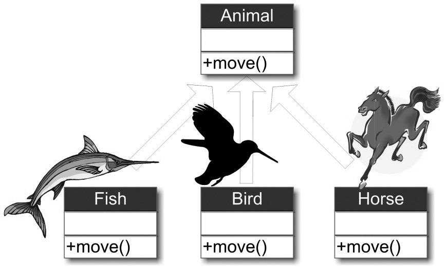
第26行声明了一个父类Animal的对象a，但没有真正实例化a。
在第27~29行分别实例化了3个子类对象：f、b和h。
第30~32行，通过赋值操作，将这些子类对象向上类型转换为Animal类型。然后经过父类对象a调用其move方法，这时我们发现，实际调用的却是各个子类对象的move方法。父类对象依据被赋值的每个子类对象的类型，做出恰当的响应（即与对象具体类别相适应的反应），这就是对象多态性的关键思想。同样的消息或接口（在本例中都是move）在发送给不同的对象时，会产生多种形式的结果，这就是多态性的本质。利用对象多态性，我们可以设计和实现更具扩展性的软件系统。提示简单来说，继承是子类使用父类的方法，而多态则是父类使用子类的方法。但更为确切地说，多态是父类使用被子类覆盖的同名方法，如果子类的方法是全新的，不存在与父类同名的方法，那么父类也不可能使用子类自己独有的“个性化”方法。有一点需要读者注意，即使实施向上转型，父类对象所能够看见的方法依然还是本类之中所定义的方法（即被子类覆盖的方法）。如果子类扩充了一些新方法的话，那么父类对象是无法找到的。请观察下面的范例。
范例8-23 父类对象找不到子类的扩充方法（NewMethodTest.java）
```
　class baseClass 
　{
　　 public void print() 
　　 {
　　　  System.out.println("*****--父类baseClass：print()") ;
　　 }
　}
　class subClass extends baseClass 
　{
　　 public void print()  // 方法覆写
　　 {  
　　　  System.out.println("#####--子类subClass：public void print()") ;
　　 }
　　 public void getB() // 此方法为子类扩充的功能
　　 {　 
　　　  System.out.println("#####--子类subClass：getB()，子类自己扩充的方法。") ;
　　 }
　}
　public class NewMethodTest 
　{
　　 public static void main(String args[]) 
　　 {
　　　  baseClass baseObj = new subClass() ; // 实例化子类对象
　　　  baseObj.print() ;　  
　　　  // baseObj.getB() ;  // 这个方法父类无法找到
　　 }
　}
```
保存并运行程序，结果如下图所示。

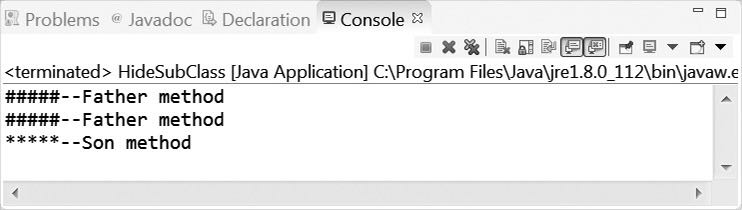

代码详解
第01~07行，定义了父类baseClass，其中包括了print()方法。
第08~18行，定义了子类subClass，它继承自父类A，其中定义了print()方法，这样就覆写了父类的同名print()方法，此外在子类subClass中，
在第14~17行，还定义了一个新扩充的方法getB()。
在第23行，通过调用子类的构造方法“new subClass ()”，实例化子类对象，并将其赋值给父类对象baseObj，
在第24行，从上面运行结果可以看出，baseObj调用的子类所定义的print()方法， 但值得我们关注的是，如果去掉第25行的注释符号“//”，就会产生如下的编译错误：“The method getB() is undefined for the baseClass （没有为类型baseClass定义方法 getB()）”，如下图所示。尽管这个父类对象baseObj的实例化依靠的是子类完成的，但是它能够看见的还是自己本类所定义的方法名称，如果方法被子类覆写了，则调用的方法体也是被子类所覆写过的方法。这其实也体现了“父母不管儿女事”的这种低耦合思想。如果说现在非要去调用subClass类的getB()方法，那么就需要进行向下转型，即将父类对象变为子类实例，向下转型需要采用强制转换的方式完成。请参见如下范例。
范例8-24 实现向下转型（DownCastTest.java）

```
　class baseClass 
　{
　　 public void print() 
　　 {
　　　  System.out.println("*****--父类baseClass：public void print(){}") ;
　　 }
　}
　class subClass extends baseClass 
　{
　　 public void print()  // 方法覆写
　　 {  
　　　  System.out.println("#####--子类subClass：print()") ;
　　 }
　　 public void getB() // 此方法为子类扩充的功能
　　 {　 
　　　  System.out.println("#####--子类subClass：getB()，子类扩充方法。") ;
　　 }
　}
　
　public class DownCastTest
　{
　　 public static void main(String args[]) 
　　 {
　　　  baseClass baseObj = new subClass() ; // 实例化子类对象
　　　  baseObj.print() ;　  //调用子类subClass的 print()
　　　  subClass subObj = (subClass) baseObj ; // 向下转型，强制完成
　　　  subObj.getB() ;  // 这个方法父类无法找到，但子类对象可以找到
　　 }
　}
```
保存并运行程序，
结果如下图所示。


代码详解
本范例和上面一个范例基本相同，差别之处仅体现在第26~27行上。在第26行，将父类的对象baseObj强制类型转换为子类对象。
在前面的范例中，对于子类添加的新方法getB()，父类的对象无法找到这个方法。但是，在第26行中，对象a前面的“(subClass)”，表明要把父类对象baseObj强制转换成子类subClass类型。然后将转换后的结果赋给一个子类subClass定义的引用subObj，于是subObj就可以顺利找到这个getB()方法（第27行）。从上面的几个范例分析来看，我们可以用一句话来概括这类关系：“在形式上，类定义的对象只能看到自己所属类中的成员。” 虽然通过向上类型转换，子类对象可以给父类对象赋值，但父类对象也仅能看到在子类中被覆盖的成员（这些方法也在父类定义过了），父类对象无法看到子类的新扩充方法。8.6.4 隐藏通过上面的学习，我们已经知道，当子类覆写了父类的同名方法时，如果用子类实例化父类对象，会发生向上类型转换，这时调用该方法时，会自动调用子类的方法，这是实现多态的基础，
参见范例8-22。但是，在某些场景下，我们不希望父类的方法被子类方法覆写，即子类实例化后会调用父类的方法，而不是子类的方法，这种情况下该怎么办？这就需要用到另外一个概念——隐藏（hide）。被关键词static修饰的静态方法是不能被覆盖的，Java就是利用这一个特性达到隐藏的效果。请观察下面的范例。
范例8-25 隐藏子类的成员（HideSubClass.java）

```
　 class Father
　 {
　　  public static void overWritting()
　　  {
　　　　System.out.println("#####--Father method");
　　  }
　 }
　 class Son extends Father
　 {
　　  public static void overWritting()
　　  {
　　　　System.out.println("*****--Son method");
　　  }
　 }
　 public class HideSubClass
　 {
　　  public static void main(String args[])
　　  {
　　　　Father dad = new Son();
　　　　dad.overWritting();
　　　　
　　　　Father.overWritting();
　　　　Son.overWritting();
　　  }
　 }
```
保存并运行程序，结果如下图所示。


代码详解第01~07行，定义了父类Father，里面定义了一个静态方法overWritting()。
第08~14行，定义了子类Son，它继承父类Father，在这个子类中，也定义了一个与父类同名的静态方法overWritting()。
第19行用子类实例化一个父类对象dad。第20行调用dad的overWritting()方法，从运行结果可以看出，这时调用的父类的方法没有被子类所覆盖，这就是说父类“隐藏”了子类的同名方法。而事实上，所有的静态方法都隶属于类，而非对象。所以，可以通过“类名.静态方法名”的方法来直接访问静态方法，如代码第22~23行所示。
从运行结果可以看出，在这样的情况下，“父类”与“子类”之间的方法就不会存在谁隐藏谁的问题。在Java中，“隐藏”概念的应用并不广泛，读者了解这个概念即可。

### 8.7 高手点拨

 * 方法重载（Overload）和覆写（Override）的区别（本题为常见的Java面试题）重载是指在相同类内定义名称相同，但参数个数（或类型，或顺序）不同的方法，而覆写是在子类当中定义名称、参数个数和类型均与父类相同的方法，用于覆写父类中的方法。具体的区别如下表所示。

|  区别 | 重载  | 覆写  |
| ------------ | ------------ | ------------ |
| 英语单词  | Overload  | Override  |
|  定义 |  法名称相同、参数的类型及个数和顺序至少一个不同 |  方法名称、参数的类型及个数、返回值类型完全相同 |
| 范围  | 只发生在一个类之中  | 发生在类的继承关系中  |
| 权限  |不受权限控制   | 被覆写的方法不能拥有比父类更严格的访问控制权限  |

在重载的关系之中，返回值类型可以不同，语法上没有错误，但是从实际的应用而言，建议返回值类型相同。

* this和super的区别（本题为常见的Java面试题）

|  区别 | this  | super  |
| ------------ | ------------ | ------------ |
| 查找范围 | 先从本类找到属性或方法，本类找不到再查找父类 | 不查询本类的属性及方法，直接由子类调用父类的指定属性及方法 |
|  调用构造 |  this调用的是本类构造方法 |  由子类调用父类构造 |
| 特殊 | 表示当前对象  | ---- |

因为this和super都可以调用构造方法，所以this()和super()语法不能同时出现，两者是二选一的关系。

*  final关键字的使用

final在Java之中称为终结器，在Java之中final可以修饰3类情况：修饰类、修饰方法及修饰变量。使用final修饰的类不能有子类（俗称“太监”类）。
如果父类的方法不希望被子类覆写，可在父类的方法前加上final关键字，这样该方法便不会有被覆写的机会。
使用final定义的方法不能被子类所覆写。在父类中，将方法设置final类型的操作，实际编程时用途并不广泛，但是在一些系统架构方面会出现得比较多，这里读者知道有这类情况存在即可。
使用final定义的变量就成为了常量。常量必须在其定义的时候就初始化（即给予赋值），这样用final修饰的变量就变成了一个常量，其值一旦确定后，便无法在后续的代码中再做修改。一般来说，为了将常量和变量区分开来，常量的命名规范要求全部字母采用大写方式表示。

*  面向对象编程PK面向过程编程（续）

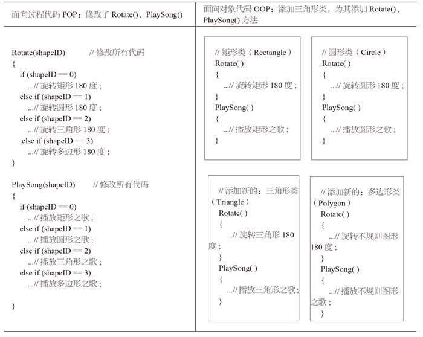

在第6章中，我们进行了面向对象编程与面向过程编程的比较。从上面的比较中，面向过程编程（POP）会认定，面向对象编程（OOP）的代码很笨拙，原因很简单，因为同样类似的代码，如Rotate()和PlaySong()，在3个不同的类中重复写了三遍，一点也不简洁。
但这样的认知并没有反映OOP的全貌，因为OOP的代码复用（Code Reuse）反映在“继承”上，在这一章，我们刚好学习完毕OOP的继承特性，我们再来“会会”POP。
现在我们假设再添加一个多边形，让它也具有Rotate()和PlaySong()特征，但是由于多边形的旋转和唱歌特性，完全不同于前3个图形，这样，POP继续添加它的else if语句，补充新代码。
OOP也添加了一个新的多边形类。需要注意的是，POP修改的代码是影响全局的。如果产品经理招聘过来一个新的员工，让他来维护过往的代码（即仅有3个图形类别的旧代码），那么这个新来的员工，就必须在“吃透”所有旧代码的基础上，完成功能的更新，但我们很难确保他会成功，他成功则罢，一旦失败，原来代码已经完成的功能也难以确保。反过来，对于OOP编程而言，由于这4个类的代码在功能上的确具有很大的相似性，因此，我们可以发挥抽象的特质，把这4个类“提炼”出来一个父类Shape，然后这4个类继承于父类，如下图所示。


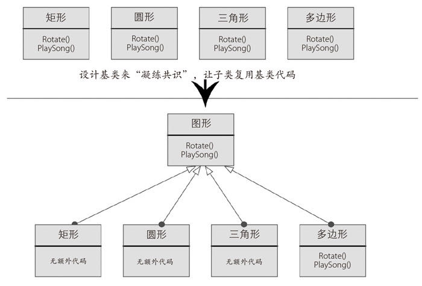

由上图可知，在OOP中，我们可以设计基类来“凝练共识”，然后让子类复用基类代码。由于矩形、圆形和三角形是规则图形，它们的Rotate( )和PlaySong( )是通用的，那么矩形、圆形和三角形这3个子类，可以从父类“图形”那里直接继承父类中的两个方法，而无需添加额外的代码，这才是真正的代码简洁！如果把Rotate( )和PlaySong( )想象为成千上万行代码的汇集，这种代码的复用带来的简洁更是“叹为观止”。但是问题来了，POP会质疑，对于“不规则图形”，它的Rotate( )和PlaySong( )不同于父类，OOP无法复用父类的方法，怎么办？这难不倒OOP，因为在子类“不规则图形”中，我们可以利用“覆写（override）”父类的方法，来达到完成子类中比较有个性化特性的方法。更重要的是，OOP可以用“多态”的概念完成同一个接口，多个性化操作，显得更加简洁化。如下图所示，在这个代码图中，其核心地方可以用8个字形容：“指哪打哪”“统一接口”。具体来说，父类可以通过向上类型转换达到“指哪打哪”，父类对象可以指向它的每一个子类对象，然后用户可用“统一接口”来完成不同子类个性化功能的调用，这减轻了用户的开发和维护负担。这样看来，OOP似乎大胜POP了！但“大胜”并不代表“完胜”，客观来讲，任何事情都有两面性，在某种应用场景下，OOP付出的代价是，其执行效率并不如POP高。


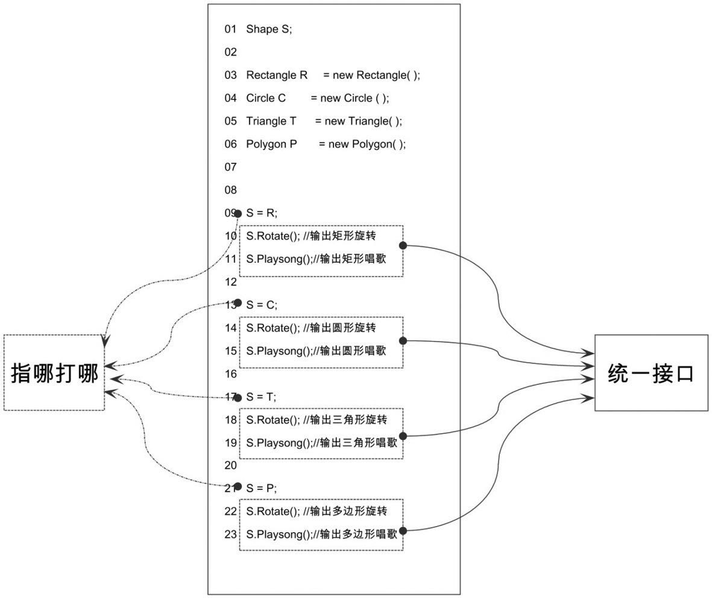


## 8.8 实战练习
1.建立一个人类（Person）和学生类（Student），功能要求如下。

（1）Person中包含4个数据成员：name、addr、sex和age，分别表示姓名、地址、性别和年龄。设计一个输出方法talk()来显示这4种属性。
（2）Student类继承Person类，并增加成员Math、English存放数学与英语成绩。用一个六参构造方法、一个两参构造方法、一个无参构造方法和覆写输出方法talk()用于显示6种属性。对于构造方法参数个数不足以初始化4个数据成员时，在构造方法中采用自己指定的默认值来实施初始化。

2.观察下面的两个类，请回答下面的问题（本题改编自华为科技有限公司面试题）。

（1）在子类中哪些方法隐藏了父类的方法?
（2）在子类中哪些方法覆盖了父类的方法?并通过编程实践验证上述问题。
```
class classA
{　　 void  methodOne(int i) { System.out.println("ClassA: methodOne, i = " + i); }
 　　 void  methodTwo(int i){ System.out.println("ClassA: methodTwo, i = " + i); }
 　　 static void  methodThree(int i){ System.out.println("ClassA: methodThree, i = " + i); }
   　 static void  methodFour(int i){ System.out.println("ClassA: methodFour, i = " + i); }　
}　
class  classB extends classA
{　　 static  void  methodOne() { System.out.println("ClassB: methodOne, i = " + i); }
　 　 void  methodTwo(int i){ System.out.println("ClassB: methodTwo, i = " + i); }
   　 void  methodThree(int i){ System.out.println("ClassB: methodThree, i = " + i); }
　 　 static  void  methodFour(int i){ System.out.println("ClassB: methodFour, i = " + i); }
}
```

3.定义一个Instrument（乐器）类，并定义其公有方法play()，再分别定义其子类Wind（管乐器），Percussion（打击乐器），Stringed（弦乐器），覆写play方法，实现每种乐器独有的play方式。最后在测试类中使用多态的方法执行每个子类的play()方法。


