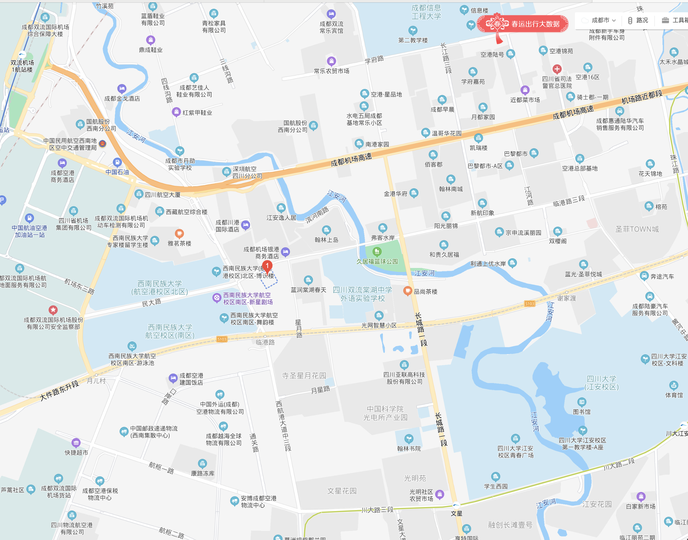
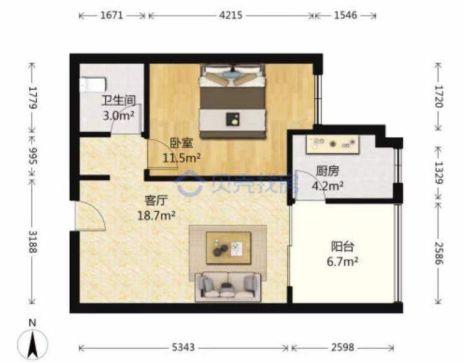
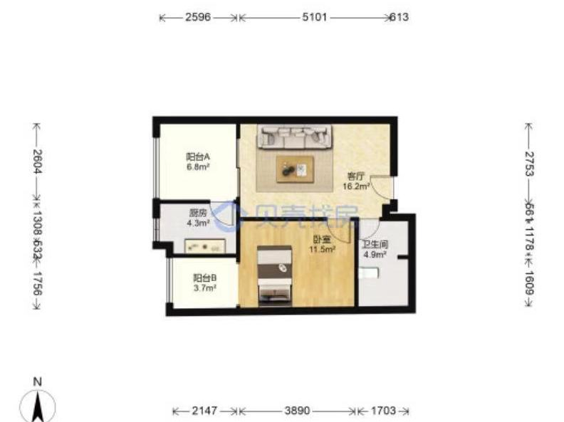
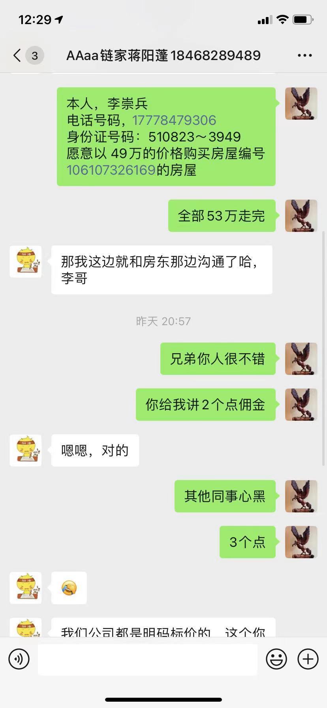
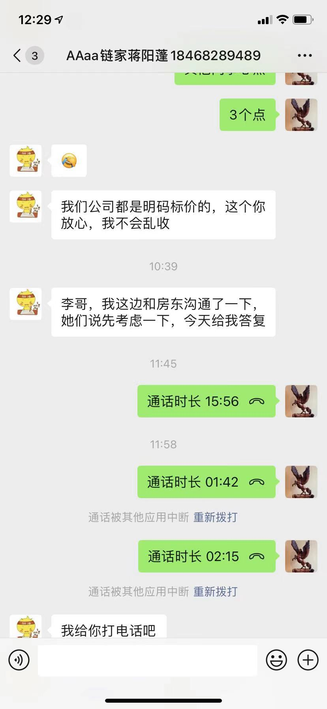
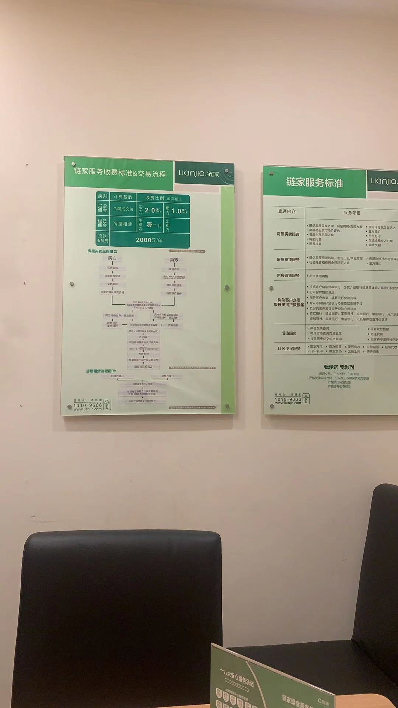
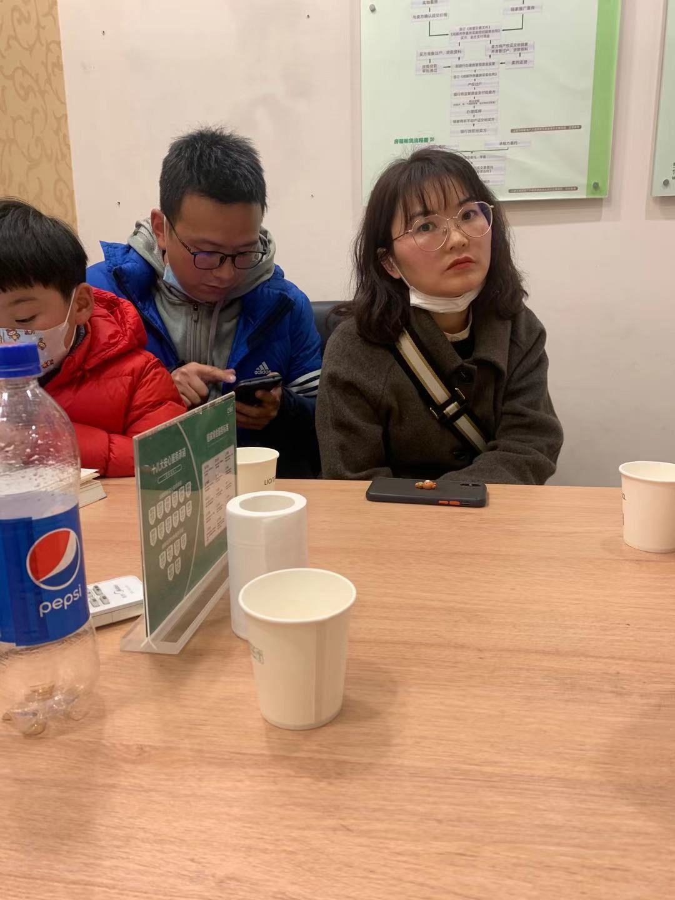
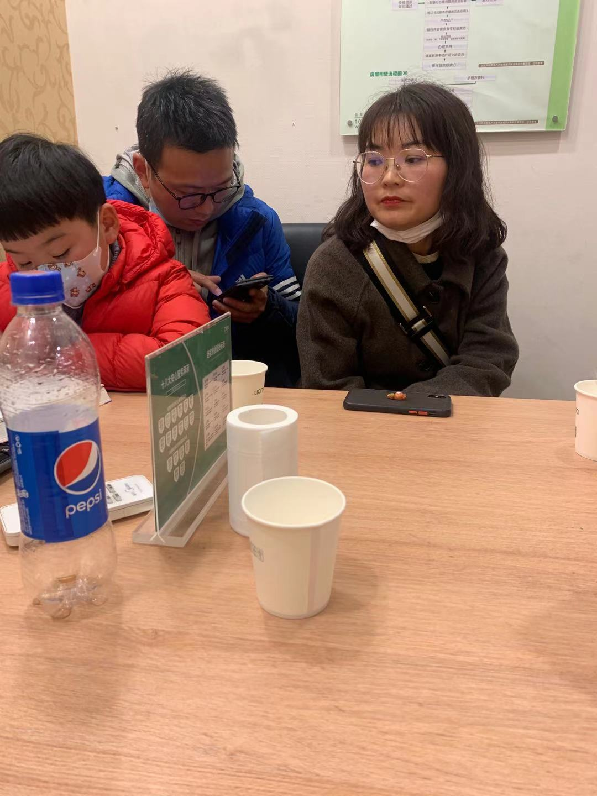
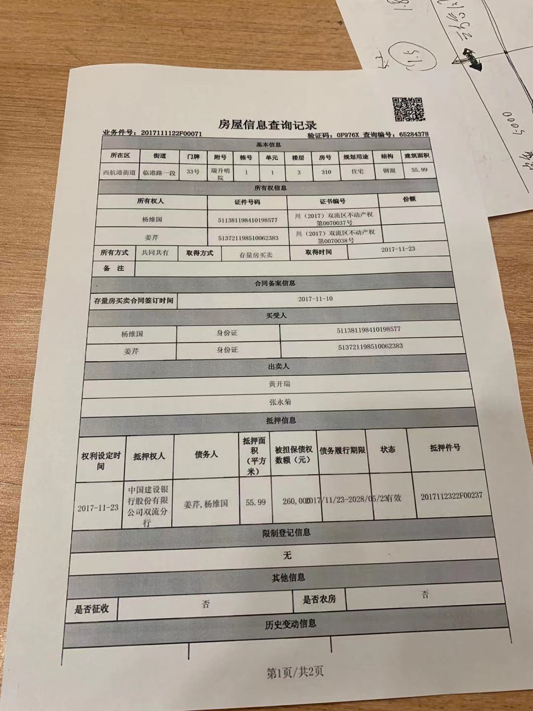
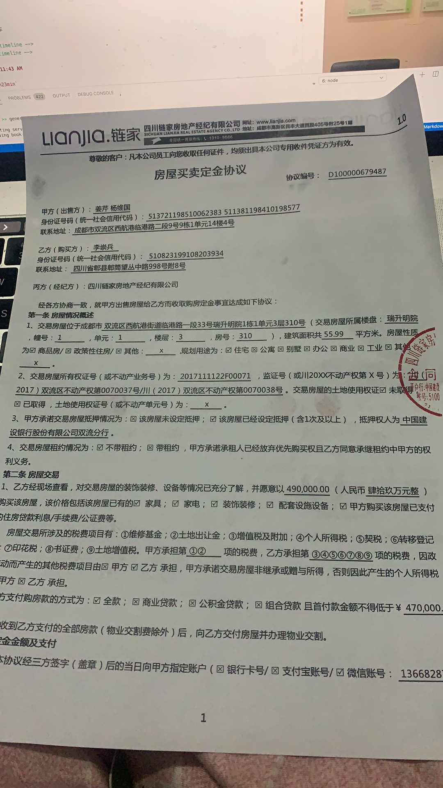

# 购房目标

* 面积50平方米左右的
* 70年住宅产权（可以落户）

# 购房记录
<!-- timeline -->

### 3月3号早上10点50分

`大哥决定买50平左右的房子`


<!-- /timeline -->
<!-- timeline -->

### 3月3号晚上九点

`在58看到首付15万买50平套三江景房`

- 经过核实是公寓销售，是广告营销，吸引人的。真实情况当地住宅价格1万2左右
- 后来决定买可以落户的房子。

<!-- /timeline -->
<!-- timeline -->

### 3月4号委托中介链家寻找房源

`最后锁定双流川大附近的瑞升明苑有2套房子`

- 地理位置 


- 单阳台户型 面积53.48平方 房龄12年  阳台朝东 价格50万，满五年，个税，契税，中介服务费2.5万，总共52.5万


- 双阳台户型 面积55.99平方 房龄12年 阳台朝西 价格51万，满二年未满5年，个税，契税，增值税，中介费合计4.5万  总共55.5万 


<!-- /timeline -->

<!-- timeline -->

### 3月5号通报大哥

`考虑单阳台户型`


- 单阳台户型 面积53.48平方 阳台朝东 价格50万，满五年，个税，契税，中介服务费2.5万，总共52.5万


<!-- /timeline -->

<!-- timeline -->
### 3月6号中午与中介沟通并约定看房

- 厨房手机实拍
<video src="1615162590232188.mp4"  controls="controls"></video>

- 阳台饭厅手机实拍
<video src="1615164995448110.mp4"  controls="controls"></video>

- 客厅手机实拍
<video src="1615162591109372.mp4"  controls="controls"></video>

- 卫生间手机实拍
<video src="1615162591728243.mp4"  controls="controls"></video>

- 卧室手机实拍
<video src="1615165002217421.mp4"  controls="controls"></video>

- 卧室阳台手机实拍
<video src="1615162592700142.mp4"  controls="controls"></video>


<!-- /timeline -->
<!-- timeline -->
### 3月6号晚上跟中介表达看法

`觉得双阳台可以价格谈判，我给出底价`



<!-- /timeline -->


<!-- timeline -->

### 3月7号下午五点中介约卖家买家面议

`到达链家门店`

`与卖家谈判`

`与卖家谈判`

`房产信息再次核实`

`谈判1个小时初步达成，卖家退让2万，51万改为49万，后期大哥定夺`

```
双阳台户型 面积55.99平方 房龄12年 阳台朝西 价格49万，
满二年未满5年，个税，契税，增值税，中介费合计4.5万 
 总共53.5万 中介承诺税费可以少报2000元。
```

<!-- /timeline -->


<font color=#D87093 size=7 face="黑体">2021年3月7日星期日</font>