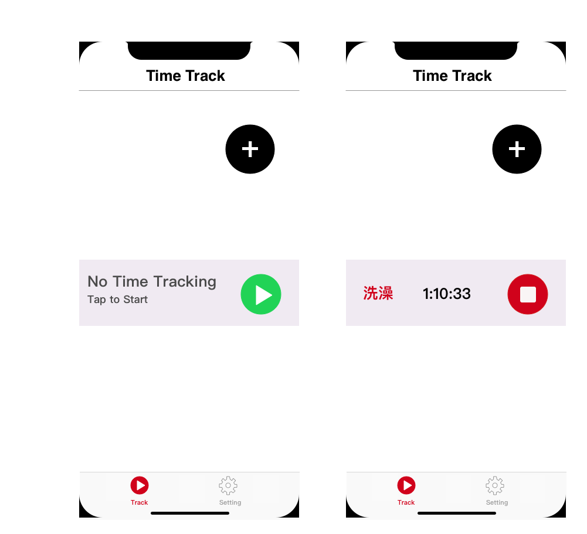
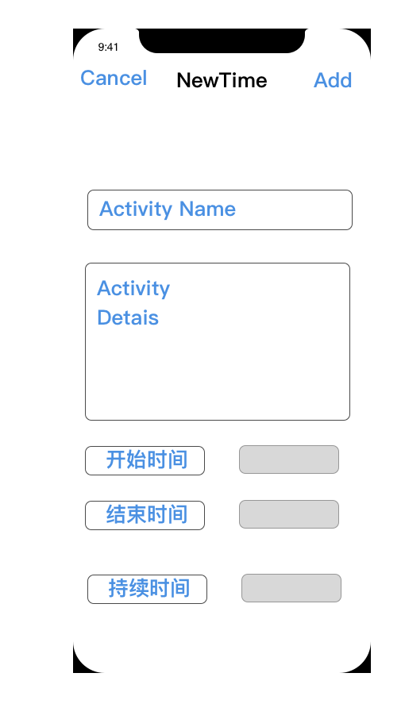
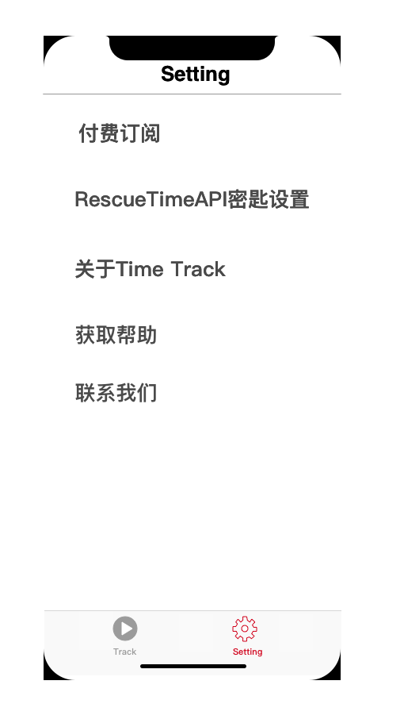
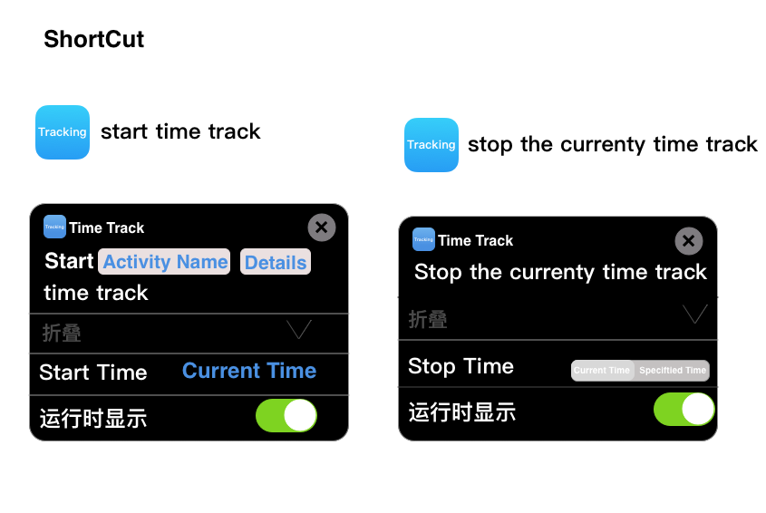

# Time Ttrack 开发文档

## 原型设计与思路分析




>这里对接FocusTime Trigger API和FocusTime Feed API的文档。处理好逻辑交互。



这里对接FocusTime Trigger API和FocusTime Feed API的文档。处理好逻辑交互。



这里是参数设定与帮助。

ios 快捷指令开发设计


>这里用到苹果SiriKit框架
>这里对接的是离线时间POST API的文档
参考项目
[官网参考工程例子](https://github.com/lichongbing/ios-swift-soup-chef)

## 服务端API说明文档
### FocusTime Trigger API的文档
>FocusTime Trigger API使您可以在活动设备上启动/结束FocusTime，这是从桌面应用程序手动启动/结束它的替代方法。这对于从第三方应用程序自动化FocusTime很有用。一个示例是在一天中的特定时间开始/结束FocusTime。

### 服务访问
到达FocusTime触发器API的基本URL为：

对于使用API​​密钥的连接：
```
https://www.rescuetime.com/anapi/start_focustime
https://www.rescuetime.com/anapi/end_focustime
```

### 必要参数
```
key  #[您的API密钥]

duration  #一个整数，以分钟为单位表示FocusTime会话的长度，并且必须是5的倍数（ 5、10、15、20 ...）。可以传递-1值来启动FocusTime，直到一天结束。

```
>注意：end_focustime端点不需要此参数。

### FocusTime Feed API的文档 

>FocusTime Feed API是最近触发的开始/结束的FocusTime会话的运行日志。每当新的FocusTime会话开始/结束时，这对于执行第三方应用程序交互非常有用。FocusTime是一项高级功能，因此，对于RescueTime Lite计划的用户， API始终将返回零结果。

### 服务访问
到达FocusTime Feed API的基本URL是：
```
https://www.rescuetime.com/anapi/focustime_started_feed
https://www.rescuetime.com/anapi/focustime_ended_feed
```
### 必要参数
```
key  -[您的API密钥]
```
输出格式
FocusTime Feed API返回一个JSON对象数组，这些数组按相反的时间顺序表示FocusTime的开始/结束事件。每个对象都具有以下结构：
```
{
  'id': float (A UNIX timestamp that represents a unique id for the event),
  'duration': integer (The initial length of time in minutes for the FocusTime Session, focustime_started_feed only),
  'created_at': datetime (The time, in user’s selected time zone, that the session was started)
}
```
查询示例
要请求最近的FocusTime启动事件的列表：
https://www.rescuetime.com/anapi/focustime_started_feed?key=YOUR_API_KEY

### 离线时间POST API的文档
>使用离线时间发布API，可以以编程方式发布离线时间，以替代在RescueTime.com上手动输入离线时间。这对于从其他系统捕获信息很有用。例如，在日历应用程序上开会后添加离线时间，或根据位置数据记录行车时间。

### 服务访问
到达离线时间POST API的基本URL是：

对于使用API​​密钥的连接： https://www.rescuetime.com/anapi/offline_time_post

### 必需的QUERY参数
```
key #您的API密钥

start_time  #表示脱机时间块开始日期/时间的字符串。该格式应为“ YYYY-MM-DD HH：MM：SS”，但是unix时间戳也是可以接受的。

end_time/duration #表示脱机时间块结束日期/时间的字符串，或者表示脱机时间块持续时间（以分钟为单位）的整数。

activity_name   #255个字符或更短的字符串，其中包含将作为活动名称输入的文本（例如，“会议”，“驾驶”，“睡觉”等）。

activity_details #255个字符或更短的字符串，其中包含将作为指定活动的详细信息输入的文本。
输出格式

```
成功的帖子将以状态码200返回。如果有错误，将返回状态码400。

### 示例请求
要发布离线时间有关会议刚刚结束：
一个POST请求发送到以下网址：
```
https://www.rescuetime.com/anapi/offline_time_post?key=YOUR_API_KEY
```
JSON主体为：
```
{
  "start_time": "2020-01-01 09:00:00",
  "duration": 60,
  "activity_name": "Meeting",
  "activity_details": "Daily Planning"
}
```