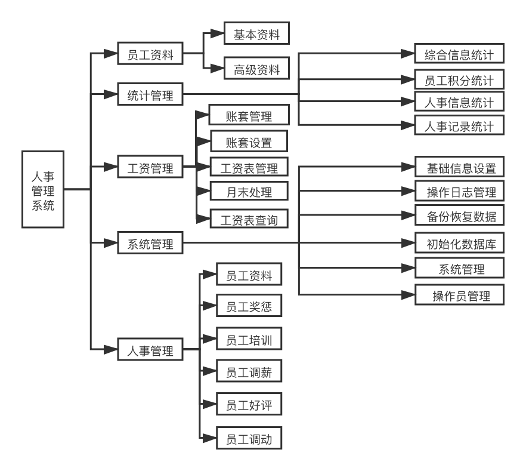
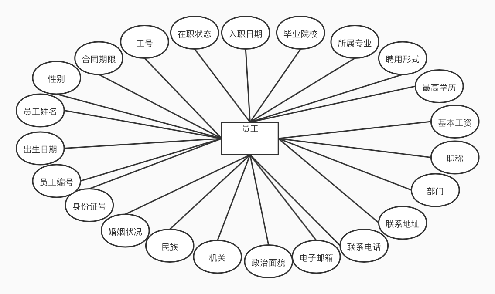

<a id="1"></a>
## 整理实战JavaWeb项目

<a id="2"></a>
### 微人事项目实战

#### 要点

* 微人事项目介绍

* 项目技术架构

* 前后端分离项目构建

* 登录模块实现

* 动态加载用户菜单

* 邮件发送

* 员工资料导入导出

* 在线聊天

* 前端项目打包

本章将通过一个前后端分离项目带读者掌握目前流行的Spring Boot+Vue前后端分离开发环境
的搭建以及项目的开发流程。本章重点向读者介绍前后端分离环境的搭建以及开发流程，也涉及少
量的业务逻辑。
本章项目的完整代码可以在GitHub上下载，下载地址为[https://github.com/lenve/vi](https://github.com/lenve/vi),本章在展示代码时仅展示项目关键步骤的核心代码。


### 项目简介

人事管理系统是一种常见的企业后台管理系统，它的主要目的是加强各个部门之间的协调提高工作效率。人事管理系统提供了员工资料管理、人事管理、工资管理、统计管理以及系统管理等功能，通过人事管理统，人事组织部门能做到以人为中心，各部门之间实现资源共享，并且实现即时通信，提高工作效率，简化烦琐的手工统计、信息汇总和工资业务等大量的人工工作，让人事组织和工资管理工作在人事组织相关的部门之间活跃起来。


### 技术架构
本项目采用当下流行的前后端分离的方式开发，后端使用 Spring Boot开发，前端使用Vue+ElementUI来构建SPA.SPA 是指 Single-Page Application,即单页面应用，SPA应用通过动 本重写当前页面来与用户交互，而非传统的从服务器重新加载整个新页面。这种方法避免了页面之间切换打断用户体验，使应用程序更像一个桌面应用程序。在SPA中，所有的HTML、JavaScript和CSS都通过单个页面的加载来检索，或者根据用户操作动态装载适当的资源并添加到页面。在SPA中，前端将通过Ajax与后端通信。对于开发者而言，SPA最直观的感受就是项目开发完成后，只有一个 HTML页面，所有页面的跳转都通过路由进行导航。前后端分离的另一个好处是一个后端可以对应多个前端，由于后端只负责提供数据，前后端的交互都是通过JSON数据完成的，因此后端开发成功后，前端可以是PC端页面，也可以是Android、iOS以及微信小程序等。

### 系统设计




#### Vue简介


Vue(读音／vju:/,类似于 view)是一套用于构建用户界面的渐进式框架。与其他大型框架不同的是，Vue 被设计为可以自底向上逐层应用。Vue 的核心库只关注视图层，不仅易于上手，还便于与第三方库或既有项目整合。另一方面，当与现代化的工具链以及各种支持类库结合使用时，Vue 完全能够为复杂的单页应用提供驱动。－Vue 官网


对于Vue的基础知识，本书不做过多介绍，由于Vue的文档都是中文文档，因此强烈建议初字者通读官方文档来了解Vue 的基本使用方法（地址为 https://cn.vuejs.org/v2/guide/),本书后面将直接介绍Vue 在项目中的使用。

#### Element 简介
Vue 桌面端组件库非常多，比较流行的有 Element、Vux、iView、mint-ui、muse-ui等，本项术用 Element 作为前端页面组件库。要说设计，这些UI库差异都不是很大，基本上都是Materialcsign 风格的，本项目采用 Element 主要考虑到该库的使用人数较多（截至写作本书时，Element的GitHub上的 star数已达 29000,接近30000),出了问题容易找到解决方案。关于Element的，强烈建议初学者通读官方文档学习（地址为http://element-cn.eleme.io/#/zh-CN/component). 


#### 其他

除了前端技术点外，后端用到的技术主要就是第1~15 章提到的技术，这里就不详细展开了
章
### 项目构建

#### 前端项目构建


Vue 项目使用 webpack 来构建。首先确保本地已经安装了 NodeJS,然后在CMD中执行如下
令，可以创建并启动一个名为vuehr的前端项目：

```
npm install -g vue-cli
vue init webpack vuehr
cd vuehr
npm run dev
```
在执行“vue init webpack vuehr”命令时，会要求依次输入项目的基本信息，如图16-1所示。

```
Project name vuehr
Project description A Vue.js project
Author 江南一点雨
<wangsong0210@gmail.com
Vue build standalone
Install vue-router?ies
Use ESLint to lint your code?No
Set up unit tests No
Setup e2e tests with Nightwatch?No
Should we run npm install for you after the project has been created?(recommended)nom 
vue-cli
Generated vuehr".
```


### 基本信息主要包括：

* 项目名称。

* 项目描述。

* 项目作者。

* Vue 项目构建：运行＋编译还是仅运行。

* 是否安装 vue-router.

* 是否使用 ESLint.

* 是否使用单元测试。

* 是否适用 Nightwatch e2e 测试。

* 是否在项目创建成功后自动执行“npm install”安装依赖，若选择否，则在第4行命令执行之
前执行“npm install”。

当“npm run dev”命令执行之后，在浏览器中输入 http://localhost:8080,显示页面
### 后端项目构建

后端使用 Spring Boot 创建一个 Spring Boot工程，添加 spring-boot-starter-web 依赖即可：

```xml
<dependency> 
<groupId>org.springframework.boot</groupId>
<artifactId>spring-boot-starter-web</artifactId>
<／dependency>
```
当然，后端所需的依赖不止spring-boot-starter-web,在后文功能不断完善的过程中，再继续鼎具他依赖。另外，后端项目所需的Redis 配置、邮件发送配置、POI配置、WebSocket配置等将在涉及相关功能时向读者介绍。

### 数据模型设计




完整的数据库脚本可以在 GitHub 上下载，下载地址为[https://github.com/lenve/vhr/blob/master/hrserver/src/main/resources/vhr.sql](https://github.com/lenve/vhr/blob/master/hrserver/src/main/resources/vhr.sql),这里仅展示本项目的数据字典。


adjustsalary表（员工调薪表）

| 字段名  |逻辑名   | 数据类型  | 约束  | 说明  |
| ------------ | ------------ | ------------ | ------------ | ------------ |
| id  |   | Integer  | 主键，自增长  | 主键  |
|  eid |   |  Integer |外键，普通索引   | 员工id  |
|  asDate |   | Date  |   | 调薪日期  |
|  beforeSalary |   |  Integer |   |  调前薪资 |
| afterSalary  |   |  Integer |   |调后薪资   |
|  reason |   | String(255)  |   | 调薪原因  |
| remark  |   |  String(255) |   | 备注  |

appraise表（员工评价表）


| 字段名  |逻辑名   | 数据类型  | 约束  | 说明  |
| ------------ | ------------ | ------------ | ------------ | ------------ |
| id  |   | Integer  | 主键，自增长  | 主键  |
|  eid |   |  Integer |外键，普通索引   | 员工id  |
|  appDate |   | Date  |   | 考评日期  |
|  appResult |   |  String(255) |   |  考评结果 |
|  appContent |   |  String(255) |   |  考评内容 |
| remark  |   |  String(255) |   | 备注  |


department表（部门表）


| 字段名  |逻辑名   | 数据类型  | 约束  | 说明  |
| ------------ | ------------ | ------------ | ------------ | ------------ |
| id  |   | Integer  | 主键，自增长  | 主键  |
|  name |   |  String(32) |  | 部门名称  |
|  parentId |   | Date  |   | 父部门id |
|  depPath |   |  String(255) |   |  部门path |
|  enabled |   |  Enum |   |  是否可用 |
| isParent  |   |  Enum  |   | 是否为父部门  |


employee表（员工信息表）


| 列名           | 数据类型                                                     | 字段类型 | 长度 | 是否为空 | 默认值 | 备注         |
| -------------- | ------------------------------------------------------------ | -------- | ---- | -------- | ------ | ------------ |
| address        | varchar(64)                                                  | varchar  | 64   | YES      |        | 联系地址     |
| beginContract  | date                                                         | date     |      | YES      |        | 合同起始日期 |
| beginDate      | date                                                         | date     |      | YES      |        | 入职日期     |
| birthday       | date                                                         | date     |      | YES      |        | 出生日期     |
| contractTerm   | double                                                       | double   |      | YES      |        | 合同期限     |
| conversionTime | date                                                         | date     |      | YES      |        | 转正日期     |
| departmentId   | int(11)                                                      | int      |      | YES      |        | 所属部门     |
| email          | varchar(20)                                                  | varchar  | 20   | YES      |        | 邮箱         |
| endContract    | date                                                         | date     |      | YES      |        | 合同终止日期 |
| engageForm     | varchar(8)                                                   | varchar  | 8    | YES      |        | 聘用形式     |
| gender         | char(4)                                                      | char     | 4    | YES      |        | 性别         |
| id             | int(11)                                                      | int      |      | NO       |        | 员工编号     |
| idCard         | char(18)                                                     | char     | 18   | YES      |        | 身份证号     |
| jobLevelId     | int(11)                                                      | int      |      | YES      |        | 职称ID       |
| name           | varchar(10)                                                  | varchar  | 10   | YES      |        | 员工姓名     |
| nationId       | int(8)                                                       | int      |      | YES      |        | 民族         |
| nativePlace    | varchar(20)                                                  | varchar  | 20   | YES      |        | 籍贯         |
| notWorkDate    | date                                                         | date     |      | YES      |        | 离职日期     |
| phone          | varchar(11)                                                  | varchar  | 11   | YES      |        | 电话号码     |
| politicId      | int(8)                                                       | int      |      | YES      |        | 政治面貌     |
| posId          | int(11)                                                      | int      |      | YES      |        | 职位ID       |
| school         | varchar(32)                                                  | varchar  | 32   | YES      |        | 毕业院校     |
| specialty      | varchar(32)                                                  | varchar  | 32   | YES      |        | 所属专业     |
| tiptopDegree   | enum('博士','硕士','本科','大专','高中','初中','小学','其他') | enum     | 2    | YES      |        | 最高学历     |
| wedlock        | enum('已婚','未婚','离异')                                   | enum     | 2    | YES      |        | 婚姻状况     |
| workAge        | int(11)                                                      | int      |      | YES      |        | 工龄         |
| workID         | char(8)                                                      | char     | 8    | YES      |        | 工号         |
| workState      | enum('在职','离职')                                          | enum     | 2    | YES      | 在职   | 在职状态     |


employeeec表（员工奖励惩罚表）


| 列名     | 数据类型     | 字段类型 | 长度 | 是否为空 | 默认值 | 备注                   |
| -------- | ------------ | -------- | ---- | -------- | ------ | ---------------------- |
| ecDate   | date         | date     |      | YES      |        | 奖罚日期               |
| ecPoint  | int(11)      | int      |      | YES      |        | 奖罚分                 |
| ecReason | varchar(255) | varchar  | 255  | YES      |        | 奖罚原因               |
| ecType   | int(11)      | int      |      | YES      |        | 奖罚类别，0：奖，1：罚 |
| eid      | int(11)      | int      |      | YES      |        | 员工编号               |
| id       | int(11)      | int      |      | NO       |        |                        |
| remark   | varchar(255) | varchar  | 255  | YES      |        | 备注                   |


employeeremove表（员工调岗表）

| 列名       | 数据类型     | 字段类型 | 长度 | 是否为空 | 默认值 | 备注       |
| ---------- | ------------ | -------- | ---- | -------- | ------ | ---------- |
| afterDepId | int(11)      | int      |      | YES      |        | 调动后部门 |
| afterJobId | int(11)      | int      |      | YES      |        | 调动后职位 |
| eid        | int(11)      | int      |      | YES      |        |            |
| id         | int(11)      | int      |      | NO       |        |            |
| reason     | varchar(255) | varchar  | 255  | YES      |        | 调动原因   |
| remark     | varchar(255) | varchar  | 255  | YES      |        |            |
| removeDate | date         | date     |      | YES      |        | 调动日期   |

employeetrain表（员工培训表）

| 列名         | 数据类型     | 字段类型 | 长度 | 是否为空 | 默认值 | 备注     |
| ------------ | ------------ | -------- | ---- | -------- | ------ | -------- |
| eid          | int(11)      | int      |      | YES      |        | 员工编号 |
| id           | int(11)      | int      |      | NO       |        |          |
| remark       | varchar(255) | varchar  | 255  | YES      |        | 备注     |
| trainContent | varchar(255) | varchar  | 255  | YES      |        | 培训内容 |
| trainDate    | date         | date     |      | YES      |        | 培训日期 |


empsalary表（员工薪资关联表）

| 列名 | 数据类型 | 字段类型 | 长度 | 是否为空 | 默认值 | 备注 |
| ---- | -------- | -------- | ---- | -------- | ------ | ---- |
| eid  | int(11)  | int      |      | YES      |        |      |
| id   | int(11)  | int      |      | NO       |        |      |
| sid  | int(11)  | int      |      | YES      |        |      |

hr表

| 列名      | 数据类型     | 字段类型 | 长度 | 是否为空 | 默认值 | 备注     |
| --------- | ------------ | -------- | ---- | -------- | ------ | -------- |
| address   | varchar(64)  | varchar  | 64   | YES      |        | 联系地址 |
| enabled   | tinyint(1)   | tinyint  |      | YES      | 1      |          |
| id        | int(11)      | int      |      | NO       |        | hrID     |
| name      | varchar(32)  | varchar  | 32   | YES      |        | 姓名     |
| password  | varchar(255) | varchar  | 255  | YES      |        | 密码     |
| phone     | char(11)     | char     | 11   | YES      |        | 手机号码 |
| remark    | varchar(255) | varchar  | 255  | YES      |        |          |
| telephone | varchar(16)  | varchar  | 16   | YES      |        | 住宅电话 |
| userface  | varchar(255) | varchar  | 255  | YES      |        |          |
| username  | varchar(255) | varchar  | 255  | YES      |        | 用户名   |

hr_role表（hr角色表）

| 列名 | 数据类型 | 字段类型 | 长度 | 是否为空 | 默认值 | 备注 |
| ---- | -------- | -------- | ---- | -------- | ------ | ---- |
| hrid | int(11)  | int      |      | YES      |        |      |
| id   | int(11)  | int      |      | NO       |        |      |
| rid  | int(11)  | int      |      | YES      |        |      |

joblevel表（职称表）

| 列名       | 数据类型                                     | 字段类型  | 长度 | 是否为空 | 默认值            | 备注     |
| ---------- | -------------------------------------------- | --------- | ---- | -------- | ----------------- | -------- |
| createDate | timestamp                                    | timestamp |      | YES      | CURRENT_TIMESTAMP |          |
| enabled    | tinyint(1)                                   | tinyint   |      | YES      | 1                 |          |
| id         | int(11)                                      | int       |      | NO       |                   |          |
| name       | varchar(32)                                  | varchar   | 32   | YES      |                   | 职称名称 |
| titleLevel | enum('正高级','副高级','中级','初级','员级') | enum      | 3    | YES      |                   |          |

menu表（菜单表）

| 列名        | 数据类型    | 字段类型 | 长度 | 是否为空 | 默认值 | 备注 |
| ----------- | ----------- | -------- | ---- | -------- | ------ | ---- |
| component   | varchar(64) | varchar  | 64   | YES      |        |      |
| enabled     | tinyint(1)  | tinyint  |      | YES      | 1      |      |
| iconCls     | varchar(64) | varchar  | 64   | YES      |        |      |
| id          | int(11)     | int      |      | NO       |        |      |
| keepAlive   | tinyint(1)  | tinyint  |      | YES      |        |      |
| name        | varchar(64) | varchar  | 64   | YES      |        |      |
| parentId    | int(11)     | int      |      | YES      |        |      |
| path        | varchar(64) | varchar  | 64   | YES      |        |      |
| requireAuth | tinyint(1)  | tinyint  |      | YES      |        |      |
| url         | varchar(64) | varchar  | 64   | YES      |        |      |


menu_role表（菜单角色关联表）
| 列名 | 数据类型 | 字段类型 | 长度 | 是否为空 | 默认值 | 备注 |
| ---- | -------- | -------- | ---- | -------- | ------ | ---- |
| id   | int(11)  | int      |      | NO       |        |      |
| mid  | int(11)  | int      |      | YES      |        |      |
| rid  | int(11)  | int      |      | YES      |        |      |

msgcontent表（消息内容表）

| 列名       | 数据类型     | 字段类型  | 长度 | 是否为空 | 默认值            | 备注 |
| ---------- | ------------ | --------- | ---- | -------- | ----------------- | ---- |
| createDate | timestamp    | timestamp |      | NO       | CURRENT_TIMESTAMP |      |
| id         | int(11)      | int       |      | NO       |                   |      |
| message    | varchar(255) | varchar   | 255  | YES      |                   |      |
| title      | varchar(64)  | varchar   | 64   | YES      |                   |      |

nation表（民族表）

| 列名       | 数据类型     | 字段类型  | 长度 | 是否为空 | 默认值            | 备注 |
| ---------- | ------------ | --------- | ---- | -------- | ----------------- | ---- |
| id         | int(11)      | int       |      | NO       |                   |      |
| name    | varchar(32) | varchar   | 32  | YES      |                   |      |


oplog表（操作日志表）

| 列名    | 数据类型     | 字段类型 | 长度 | 是否为空 | 默认值 | 备注     |
| ------- | ------------ | -------- | ---- | -------- | ------ | -------- |
| addDate | date         | date     |      | YES      |        | 添加日期 |
| hrid    | int(11)      | int      |      | YES      |        | 操作员ID |
| id      | int(11)      | int      |      | NO       |        |          |
| operate | varchar(255) | varchar  | 255  | YES      |        | 操作内容 |


politicsstatus表（政治面貌表）

| 列名 | 数据类型    | 字段类型 | 长度 | 是否为空 | 默认值 | 备注 |
| ---- | ----------- | -------- | ---- | -------- | ------ | ---- |
| id   | int(11)     | int      |      | NO       |        |      |
| name | varchar(32) | varchar  | 32   | YES      |        |      |

position表( 职位表)

| 列名       | 数据类型    | 字段类型  | 长度 | 是否为空 | 默认值            | 备注 |
| ---------- | ----------- | --------- | ---- | -------- | ----------------- | ---- |
| createDate | timestamp   | timestamp |      | YES      | CURRENT_TIMESTAMP |      |
| enabled    | tinyint(1)  | tinyint   |      | YES      | 1                 |      |
| id         | int(11)     | int       |      | NO       |                   |      |
| name       | varchar(32) | varchar   | 32   | YES      |                   | 职位 |


role表（角色表）


| 列名   | 数据类型    | 字段类型 | 长度 | 是否为空 | 默认值 | 备注     |
| ------ | ----------- | -------- | ---- | -------- | ------ | -------- |
| id     | int(11)     | int      |      | NO       |        |          |
| name   | varchar(64) | varchar  | 64   | YES      |        |          |
| nameZh | varchar(64) | varchar  | 64   | YES      |        | 角色名称 |


salary表（薪水表）


| 列名                 | 数据类型    | 字段类型  | 长度 | 是否为空 | 默认值 | 备注         |
| -------------------- | ----------- | --------- | ---- | -------- | ------ | ------------ |
| accumulationFundBase | int(11)     | int       |      | YES      |        | 公积金基数   |
| accumulationFundPer  | float       | float     |      | YES      |        | 公积金比率   |
| allSalary            | int(11)     | int       |      | YES      |        | 应发工资     |
| basicSalary          | int(11)     | int       |      | YES      |        | 基本工资     |
| bonus                | int(11)     | int       |      | YES      |        | 奖金         |
| createDate           | timestamp   | timestamp |      | YES      |        | 启用时间     |
| id                   | int(11)     | int       |      | NO       |        |              |
| lunchSalary          | int(11)     | int       |      | YES      |        | 午餐补助     |
| medicalBase          | int(11)     | int       |      | YES      |        | 医疗基数     |
| medicalPer           | float       | float     |      | YES      |        | 医疗保险比率 |
| name                 | varchar(32) | varchar   | 32   | YES      |        |              |
| pensionBase          | int(11)     | int       |      | YES      |        | 养老金基数   |
| pensionPer           | float       | float     |      | YES      |        | 养老金比率   |
| trafficSalary        | int(11)     | int       |      | YES      |        | 交通补助     |

sysmsg表（系统消息表）

| 列名  | 数据类型 | 字段类型 | 长度 | 是否为空 | 默认值 | 备注             |
| ----- | -------- | -------- | ---- | -------- | ------ | ---------------- |
| hrid  | int(11)  | int      |      | YES      |        | 这条消息是给谁的 |
| id    | int(11)  | int      |      | NO       |        |                  |
| mid   | int(11)  | int      |      | YES      |        | 消息id           |
| state | int(11)  | int      |      | YES      | 0      | 0 未读 1 已读    |
| type  | int(11)  | int      |      | YES      | 0      | 0表示群发消息    |


mail_send_log表（邮件发送日志表）


| 列名  | 数据类型 | 字段类型 | 长度 | 是否为空 | 默认值 | 备注             |
| ----- | -------- | -------- | ---- | -------- | ------ | ---------------- |
| hrid  | int(11)  | int      |      | YES      |        | 这条消息是给谁的 |
| id    | int(11)  | int      |      | NO       |        |                  |
| mid   | int(11)  | int      |      | YES      |        | 消息id           |
| state | int(11)  | int      |      | YES      | 0      | 0 未读 1 已读    |
| type  | int(11)  | int      |      | YES      | 0      | 0表示群发消息    |

经过以上准备工作，项目环境就已经基本搭建成功了。另外，对于Redis的安装、启动等，读者可以参考第6章，这里不再赘述。

## 登录模块


### 后端接口实现

后端权限认证采用 Spring Security 实现（本小节中大量知识点与第10章的内容相关，需要读练享握第10章的内容），数据库访问使用MyBatis,同时使用Redis实现认证信息缓存。因此叫自光添加如下依赖（依次是MvBatis 依赖、Spring Security 依赖、Redis 依赖、数据库连接池依赖、数据库驱动依赖以及缓存依赖）
```xml
 <dependency>
            <groupid>org.mybatis.spring.boot</groupld>
            <artifactld>>mvbatis-spring-boot-starter</artifactld>
            <version>1.3.2</version>
</dependency>
<dependency>
            <groupId>org.springframework.boot</groupId>
            <artifactId>spring-boot-starter-security</artifactId>
            <／dependency>
<dependency>
            <groupId>org.springframework.boot</groupId>
            <artifactId>spring-boot-starter-data-redis</artifactId>
            <exclusions>
                  <exclusion>
                     <groupId>io.lettuce</groupId>
                     <artifactId>lettuce-core</artifactId>
                   </exclusion>
            </exclusions>
</dependency>
<dependency>
            <groupId>redis.clients</groupId>
            <artifactId>jedis</artifactId>
            </dependency>
<dependency>
            <groupId>com.alibaba</groupId>
            <artifactId>druid</artifactId>
            <version>1.1.10</version>
</dependency>
            <dependency>
            <groupId>mysql</groupId>
            <artifactId>mysql-connector-java</artifactId>
</dependency>
            <dependency>
            <groupId>org.springframework.boot</groupId>
            <artifactId>spring-boot-starter-cache</artifactId>
</dependency>

```


依赖添加完成后，接下来在 application.properties 中配置数据库连接、Redis连接以及缓存等。

```yml
＃MySQL配置
spring.datasource.type=com.alibaba.druid.pool.DruidDataSource
spring.datasource.url=jdbc:mysql://127.0.0.1:3306/vhr
spring.datasource.username=root
spring.datasource.password=root
＃MyBatis日志配置
mybatis.config-location=classpath:/mybatis-config.xml
＃Redis配置
spring.redis.database=0
spring.redis.host=192.168.66.130
spring.redis.port=6379
spring.redis.password=123@456
spring.redis.jedis.pool.max-active=8
spring.redis.jedis.pool.max-idle=8
spring.redis.jedis.pool.max-wait=-1ms
spring.redis.jedis.pool.min-idle=0
＃缓存配置
spring.cache.cache-names=menus cache
spring.cache.redis.time-to-live=1800s
＃端口配置
server.port=8082
```
配置完成后，接下来实现用户认证的配置。用户认证使用Spring Security 实现，因此需要首先
提供一个 UserDetails的实例，在人事管理系统中，登录操作是Hr登录，根据前面的Hr表创建Hr
实体类并实现 UserDetails 接口，代码如下：
```java
import com.fasterxml.jackson.annotation.JsonIgnore;
import org.springframework.security.core.GrantedAuthority;
import org.springframework.security.core.authority.SimpleGrantedAuthority;
import org.springframework.security.core.userdetails.UserDetails;

import java.util.ArrayList;
import java.util.Collection;
import java.util.List;
import java.util.Objects;

public class Hr implements UserDetails {
    private Integer id;

    private String name;

    private String phone;

    private String telephone;

    private String address;

    private Boolean enabled;

    private String username;

    private String password;

    private String userface;

    private String remark;
    private List<Role> roles;

    @Override
    public boolean equals(Object o) {
        if (this == o) return true;
        if (o == null || getClass() != o.getClass()) return false;
        Hr hr = (Hr) o;
        return Objects.equals(username, hr.username);
    }

    @Override
    public int hashCode() {
        return Objects.hash(username);
    }

    public List<Role> getRoles() {
        return roles;
    }

    public void setRoles(List<Role> roles) {
        this.roles = roles;
    }

    public Integer getId() {
        return id;
    }

    public void setId(Integer id) {
        this.id = id;
    }

    public String getName() {
        return name;
    }

    public void setName(String name) {
        this.name = name == null ? null : name.trim();
    }

    public String getPhone() {
        return phone;
    }

    public void setPhone(String phone) {
        this.phone = phone == null ? null : phone.trim();
    }

    public String getTelephone() {
        return telephone;
    }

    public void setTelephone(String telephone) {
        this.telephone = telephone == null ? null : telephone.trim();
    }

    public String getAddress() {
        return address;
    }

    public void setAddress(String address) {
        this.address = address == null ? null : address.trim();
    }

    public void setEnabled(Boolean enabled) {
        this.enabled = enabled;
    }

    public String getUsername() {
        return username;
    }

    @Override
    public boolean isAccountNonExpired() {
        return true;
    }

    @Override
    public boolean isAccountNonLocked() {
        return true;
    }

    @Override
    public boolean isCredentialsNonExpired() {
        return true;
    }

    @Override
    public boolean isEnabled() {
        return enabled;
    }

    public void setUsername(String username) {
        this.username = username == null ? null : username.trim();
    }

    @Override
    @JsonIgnore
    public Collection<? extends GrantedAuthority> getAuthorities() {
        List<SimpleGrantedAuthority> authorities = new ArrayList<>(roles.size());
        for (Role role : roles) {
            authorities.add(new SimpleGrantedAuthority(role.getName()));
        }
        return authorities;
    }

    public String getPassword() {
        return password;
    }

    public void setPassword(String password) {
        this.password = password == null ? null : password.trim();
    }

    public String getUserface() {
        return userface;
    }

    public void setUserface(String userface) {
        this.userface = userface == null ? null : userface.trim();
    }

    public String getRemark() {
        return remark;
    }

    public void setRemark(String remark) {
        this.remark = remark == null ? null : remark.trim();
    }
}

```

### 代码解释：

* 自定义类继承自 UserDetails,并实现该接口中相关的方法。前端用户在登录成功后，需要获取当前登录用户的信息，对于一些敏感信息不必返回，使用@JsonIgnore注解即可。

* 对于 isAccountNonExpired、isAccountNonLocked、isCredentialsNonExpired,由于Hr表并未设计相关字段，因此这里直接返回true,isEnabled方法则根据实际情况返回。

* roles 属性中存储了当前用户的所有角色信息，在 getAuthorities 方法中，将这些角色转换为
List<GrantedAuthority>的实例返回。

接下来提供一个 UserDetailsService实例用来查询用户，代码如下：

```java
@Service
public class HrService implements UserDetailsService {
    @Autowired
    HrMapper hrMapper;
    @Autowired
    HrRoleMapper hrRoleMapper;

    @Override
    public UserDetails loadUserByUsername(String username) throws UsernameNotFoundException {
        Hr hr = hrMapper.loadUserByUsername(username);
        if (hr == null) {
            throw new UsernameNotFoundException("用户名不存在!");
        }
        hr.setRoles(hrMapper.getHrRolesById(hr.getId()));
        return hr;
    }
}
```

自定义HrService实现 UserDetailsService 接口，并实现该接口中的loadUserByUsemname方法，loadUserBy Username 方法是根据用户名查询用户的所有信息，包括用户的角色，如果没有查到相关用户，就抛出 UsernameNotFoundException 异常，表示用户不存在，如果查到了，就直接返回，由 Spring Security 框架完成密码的比对操作。
接下来需要实现动态配置权限，因此还需要提供 FilterInvocationSecurityMetadataSource 和AccessDecisionManager的实例。 
FilterInvocationSecurityMetadataSource 代码如下：
```java
@Component
public class CustomFilterInvocationSecurityMetadataSource implements FilterInvocationSecurityMetadataSource {
    @Autowired
    MenuService menuService;
    AntPathMatcher antPathMatcher = new AntPathMatcher();
    @Override
    public Collection<ConfigAttribute> getAttributes(Object object) throws IllegalArgumentException {
        String requestUrl = ((FilterInvocation) object).getRequestUrl();
        List<Menu> menus = menuService.getAllMenusWithRole();
        for (Menu menu : menus) {
            if (antPathMatcher.match(menu.getUrl(), requestUrl)) {
                List<Role> roles = menu.getRoles();
                String[] str = new String[roles.size()];
                for (int i = 0; i < roles.size(); i++) {
                    str[i] = roles.get(i).getName();
                }
                return SecurityConfig.createList(str);
            }
        }
        return SecurityConfig.createList("ROLE_LOGIN");
    }

    @Override
    public Collection<ConfigAttribute> getAllConfigAttributes() {
        return null;
    }

    @Override
    public boolean supports(Class<?> clazz) {
        return true;
    }
}
```
### 代码解释：


* 在getAttributes 方法中首先提取出请求 URL,根据请求URL判断该请求需要的角色信息。
* 通过 MenuService 中的 getAllMenu 方法获取所有的莱单资源进行比对，考虑到getAttributes方法在每一次请求中都会调用，因此可以将 getAllMenu 方法的返回值缓存下来，下一次请求时直接从缓存中获取。
* 对于所有未匹配成功的请求，默认都是登录后访问。

AccessDecisionManager 代码如：
```java
@Component
public class UrlAccessDecisionManager implements AccessDecisionManager{
     @override
     public void decide(Authentication auth,Object o,Collection<ConfigAttribute>cas){
        Iterator<ConfigAttribute>iterator=cas.iterator();
        while (iterator.hasNext()){
        ConfigAttribute ca=iterator.next();
        String needRole=ca.getAttribute();
        if("ROLE LOGIN".equals(needRole)){
            if (auth instanceof AnonymousAuthenticationroken){
                throw new BadCredentialsException("未登录");
            ｝else {
            return;
            }
        }
       Collection<?extends GrantedAuthority> authorities = auth.getAuthorities();
       for(GrantedAuthority authority:authorities){
          if(authority.getAuthority().equals(needRole)){
          return;
          }
        ｝
        ｝

       throw new AccessDeniedException("权限不足");
    }
    @Override
    public boolean supports(ConfigAttribute configAttribute){
    return true;
    ｝
    @Override
     public boolean supports(Class<?>aClass){
    return true;
    }
}
```


```java
@Component
public class CustomUrlDecisionManager implements AccessDecisionManager {
    @Override
    public void decide(Authentication authentication, Object object, Collection<ConfigAttribute> configAttributes) throws AccessDeniedException, InsufficientAuthenticationException {
        for (ConfigAttribute configAttribute : configAttributes) {
            String needRole = configAttribute.getAttribute();
            if ("ROLE_LOGIN".equals(needRole)) {
                if (authentication instanceof AnonymousAuthenticationToken) {
                    throw new AccessDeniedException("尚未登录，请登录!");
                }else {
                    return;
                }
            }
            Collection<? extends GrantedAuthority> authorities = authentication.getAuthorities();
            for (GrantedAuthority authority : authorities) {
                if (authority.getAuthority().equals(needRole)) {
                    return;
                }
            }
        }
        throw new AccessDeniedException("权限不足，请联系管理员!");
    }

    @Override
    public boolean supports(ConfigAttribute attribute) {
        return true;
    }

    @Override
    public boolean supports(Class<?> clazz) {
        return true;
    }
}
```
### 代码解释：
* 在decide方法中判断当前用户是否具备请求需要的角色，若该方法在执行过程中未抛出异常，则说明请求可以通过；若抛出异常，则说明请求权限不足。
* 如果所需要的角色是 ROLE LOGIN,那么只需要判断 auth 不是匿名用户的实例，即表示当前用户已登录。

接下来提供一个 AccessDeniedHandler的实例来返回授权失败的信息：

```java
@Component
public class AuthenticationAccessDeniedHandler implements AccessDeniedHandler{
    @Override
    public void handle(HttpServletRequest httpServletRequest,HttpServletResponse resp,AccessDeniedException e)throws IOException{
      resp.setStatus(HttpServletResponse.SC FORBIDDEN);
      resp.setContentType("application/json;charset=UTF-8");
      Printwriter out = resp.getwriter();
      RespBean error=RespBean.error("权限不足，请联系管理员!");
      out.write(new objectMapper().writeValueAsString(error));
      out.flush();
      out.close();
    }
}
```
当授权失败时，在这里返回授权失败信息。
当所有工作完成后，接下来配置Spring Security 代码如下：

```java
@Configuration
public class WebSecurityConfig extends WebSecurityConfigurerAdapter {
    @Autowired
    HrService hrService;
    @Autowired
    CustomFilterInvocationSecurityMetadataSource customFilterInvocationSecurityMetadataSource;
    @Autowired
    UrlAccessDecisionManager urlAccessDecisionManager;
    @Autowired
    AuthenticationAccessDeniedHandler deniedHandler;
    @override
    public void configure(WebSecurity web) throws Exception{  
     web.ignoring().antMatchers("/index.html","/static/**","/login_p");
    ｝
    @Override
    protected void configure(HttpSecurity http)throws Exception
    http.authorizeRequests().withobjectPostProcessor(new AObectPostProcessor)<FiltersecurityInterceptor>(){
    @Override
    public ＜o extends FilterSecurityInterceptor>O postProcess(O o){
    o.setSecurityMetadataSource(metadataSource);
    o.setAccessDecisionManager(urlAccessDecisionManager);
    return o;
}
｝}
   o.and().formLogin().loginPage("/login p").loginProcessingUrl("/login").usernameParameter("username").passwordParameter("password").failureHandler(new AuthenticationFailureHandler(){
   @Override
   public void onAuthenticationFailure(HttpServletRequest req,HttpServletResponse resp,AuthenticationException e)throws IOException{
    wblugsnresp.setContentType("application/json;charset=utf-8");
    RespBean respBean=null;
    if(e instanceof BadCredentialsException || e instanceof UsernameNotFoundException){
      respBean=RespBean.error（"账户名或者密码输入错误！"）;
     ｝else if(e instanceof LockedException){
      respBean=RespBean.error("账户被锁定，请联系管理员！"）;
    ｝else if(e instanceof CredentialsExpiredException){
      respBean=RespBean.error("密码过期，请联系管理员！”）;
    ｝else if(e instanceof AccountExpiredException){
     respBean=RespBean.error(“账户过期，请联系管理员！"）;
    ｝else if(e instanceof DisabledException){o
     respBean=RespBean.error(”账户被票用，请联系管理员！”）;
    ｝else {
     respBean=RespBean.error(“登录失败");
    ｝
    resp.setStatus(401);
    ObjectMapper om=new ObjectMapper();
    Printwriter out=resp.getwriter():
    out.write(om.writeValueAsString(respBean));
    out.flush();eHsdeeoAnons
    out.close();
    }
 })
.successHandler(new AuthenticationSuccessHandler()
   @Override
   public void onAuthenticationSuccess(HttpServletRequest req,HttpServletResponse resp,Authentication auth) throws IOException{
   resp.setContentType("application/json;charset=utf-8");
   RespBean respBean=RespBean.ok("登录成功！”，HrUtils.getCurrentHr());
   ObjectMapper om=new ObjectMapper();
   PrintWriter out=resp.getwriter();
   out.write(om.writeValueAsString(respBean));denoddiw
   out.flush();
   out.close();
}
｝)
.permitA1l()oteooAltu).and().logout().permitA1l().land().csrf().disable().exceptionHandling().accessDeniedHandler(deniedHandler);
   ｝
}
```
## 代码解释：

* 首先通过@EnableGlobalMethodSecurity 注解开启基于注解的安全配置，启用@PreAuthorize和@PostAuthorize两个注解。

* 在配置类中注入之前创建的4个Bean,在 AuthenticationManagerBuilder 中配置userDetailsService和passwordEncoder.

* 在 WebSecurity 中配置需要忽略的路径。

* 在 HttpSecurity 中配置拦截规则、表单登录、登录成功或失败的响应等。

* 最后通过accessDeniedHandler配置异常处理。

另外，前文提到MenuService 中的 getAllMenu 方法在每次请求时都需要查询数据库，效率极低，因此可以将该数据缓存下来，代码如下：
```java
@Service
@Transactional
@CacheConfig(cacheNames="menus_cache")
public class MenuService{
    @Autowired
    MenuMapper menuMapper;
    @Cacheable(key="＃root.methodName")
    public List<Menu>getAllMenu(){
       return menuMapper.getAllMenu();
    }
}
```
##注意

>这里使用方法名作为缓存的key,另外需要在项目启动类添加@EnableCashing注解开启缓存。

PostMan测试（待写）

## 前端实现
### 引入Element和Axios

前端UI使用Element，网络请求则使用Axios，
代码如下：
```
npm i element-ui -S
npm i axios -S
```
依赖添加成功后，接下来在main.js中引入Element
代码如下
```
import ElementUI from 'element-ui'
import 'element-ui/lib/theme-chalk/index.css';
Vue.use(ElementUI)
```
引入Element 之后，接下来就可以在项目中直接使用相关组件了。
对于网络请求，由于在每一次请求时都需要判断各种异常情况，然后提示用户，例如请求是否成功、失败的原因等，考虑到这些判断基本上都使用重复的代码，因此可以将网络请求封装，做成Vue的插件方便使用。由于封装的代码比较长，这里就不贴出来了，读者可以在GitHub 上查看，地址为 [app.js](https://github.com/lenve/vhr/blob/master/vuehr/src/utils/api.js)配置完成后，在main.js中导入封装的方法，然后配置为Vue的prototype,代码如下：

```
import {postRequest} from "./utils/api";
import {postKeyValueRequest} from "./utils/api";
import {putRequest} from "./utils/api";
import {deleteRequest} from "./utils/api";
import {getRequest} from "./utils/api";
import {initMenu} from "./utils/menus";
import 'font-awesome/css/font-awesome.min.css'
Vue.prototype.postRequest = postRequest;
Vue.prototype.postKeyValueRequest = postKeyValueRequest;
Vue.prototype.putRequest = putRequest;
Vue.prototype.deleteRequest = deleteRequest;
Vue.prototype.getRequest = getRequest;
```
配置完成后，接下来对于任何需要使用网络请求的地址，都可以使用this.XXX执行一个网络请求，例如要执行登录请求，就可以通过this.postRequest(url,param)执行。
### 开发 Login 页面
接下来在 components 目录下创建 Login.vue 页面进行登录页面开发，代码如下：
```
<template>
    <div>
        <el-form
                :rules="rules"
                ref="loginForm"
                v-loading="loading"
                element-loading-text="正在登录..."
                element-loading-spinner="el-icon-loading"
                element-loading-background="rgba(0, 0, 0, 0.8)"
                :model="loginForm"
                class="loginContainer">
            <h3 class="loginTitle">系统登录</h3>
            <el-form-item prop="username">
                <el-input size="normal" type="text" v-model="loginForm.username" auto-complete="off"
                          placeholder="请输入用户名"></el-input>
            </el-form-item>
            <el-form-item prop="password">
                <el-input size="normal" type="password" v-model="loginForm.password" auto-complete="off"
                          placeholder="请输入密码"></el-input>
            </el-form-item>
            <el-form-item prop="code">
                <el-input size="normal" type="text" v-model="loginForm.code" auto-complete="off"
                          placeholder="点击图片更换验证码" @keydown.enter.native="submitLogin" style="width: 250px"></el-input>
                
            </el-form-item>
            <el-checkbox size="normal" class="loginRemember" v-model="checked"></el-checkbox>
            <el-button size="normal" type="primary" style="width: 100%;" @click="submitLogin">登录</el-button>
        </el-form>
    </div>
</template>

<script>

    export default {
        name: "Login",
        data() {
            return {
                loading: false,
                vcUrl: '/verifyCode?time='+new Date(),
                loginForm: {
                    username: 'admin',
                    password: '123',
                    code:''
                },
                checked: true,
                rules: {
                    username: [{required: true, message: '请输入用户名', trigger: 'blur'}],
                    password: [{required: true, message: '请输入密码', trigger: 'blur'}],
                    code: [{required: true, message: '请输入验证码', trigger: 'blur'}]
                }
            }
        },
        methods: {
            updateVerifyCode() {
                this.vcUrl = '/verifyCode?time='+new Date();
            },
            submitLogin() {
                this.$refs.loginForm.validate((valid) => {
                    if (valid) {
                        this.loading = true;
                        this.postRequest('/doLogin', this.loginForm).then(resp => {
                            this.loading = false;
                            if (resp) {
                                this.$store.commit('INIT_CURRENTHR', resp.obj);
                                window.sessionStorage.setItem("user", JSON.stringify(resp.obj));
                                let path = this.$route.query.redirect;
                                this.$router.replace((path == '/' || path == undefined) ? '/home' : path);
                            }else{
                                this.vcUrl = '/verifyCode?time='+new Date();
                            }
                        })
                    } else {
                        return false;
                    }
                });
            }
        }
    }
</script>

<style>
    .loginContainer {
        border-radius: 15px;
        background-clip: padding-box;
        margin: 180px auto;
        width: 350px;
        padding: 15px 35px 15px 35px;
        background: #fff;
        border: 1px solid #eaeaea;
        box-shadow: 0 0 25px #cac6c6;
    }

    .loginTitle {
        margin: 15px auto 20px auto;
        text-align: center;
        color: #505458;
    }

    .loginRemember {
        text-align: left;
        margin: 0px 0px 15px 0px;
    }
    .el-form-item__content{
        display: flex;
        align-items: center;
    }
</style>    
```

配置路由
```
import Vue from 'vue'
import Router from 'vue-router'
import Login from './views/Login.vue'
import Home from './views/Home.vue'
import FriendChat from './views/chat/FriendChat.vue'
import HrInfo from './views/HrInfo.vue'

Vue.use(Router)

export default new Router({
    routes: [
        {
            path: '/',
            name: 'Login',
            component: Login,
            hidden: true
        }, {
            path: '/home',
            name: 'Home',
            component: Home,
            hidden: true,
            meta: {
                roles: ['admin', 'user']
            },
            children: [
                {
                    path: '/chat',
                    name: '在线聊天',
                    component: FriendChat,
                    hidden: true
                }, {
                    path: '/hrinfo',
                    name: '个人中心',
                    component: HrInfo,
                    hidden: true
                }
            ]
        }, {
            path: '*',
            redirect: '/home'
        }
    ]
})
```
修改去除默认VueLogo

```
<template>
  <div id="app">
    <router-view/>
  </div>
</template>
```
#### 配置请求转发
修改config的index.js文件，修改proxyTable，代码如下：
```

```

#### 启动前端项目

 ```
 npm run dev
 ```

 ### 动态加载用户菜单


```mermaid
flowchat
st=>start: 开始
e=>end: 结束
op=>operation: 我的操作
cond=>condition: 确认？

st->op->cond
cond(yes)->e
cond(no)->op
```


